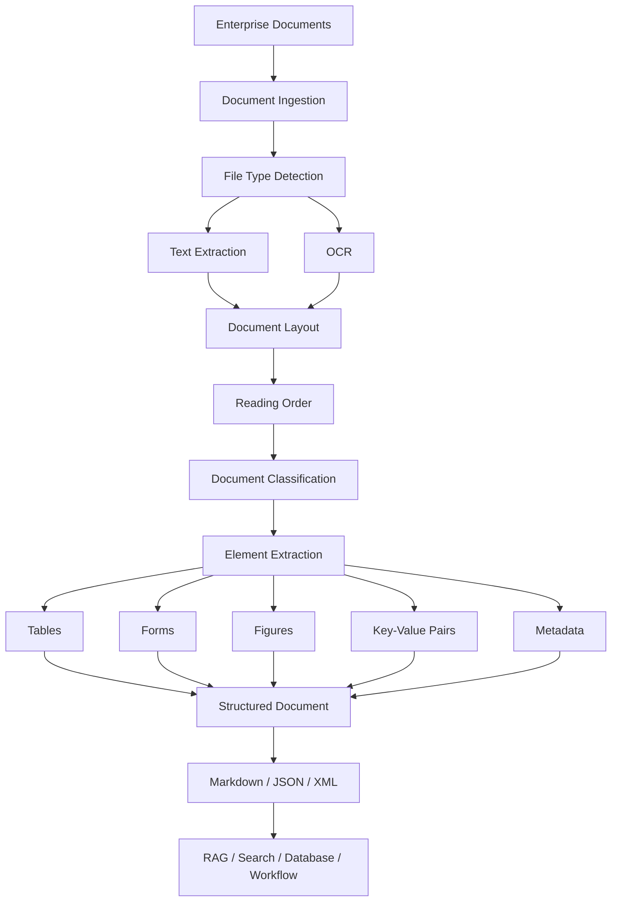
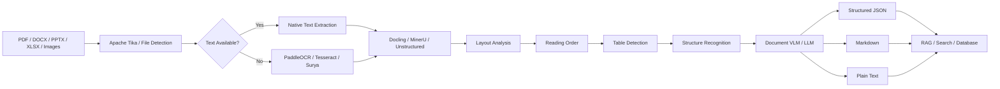
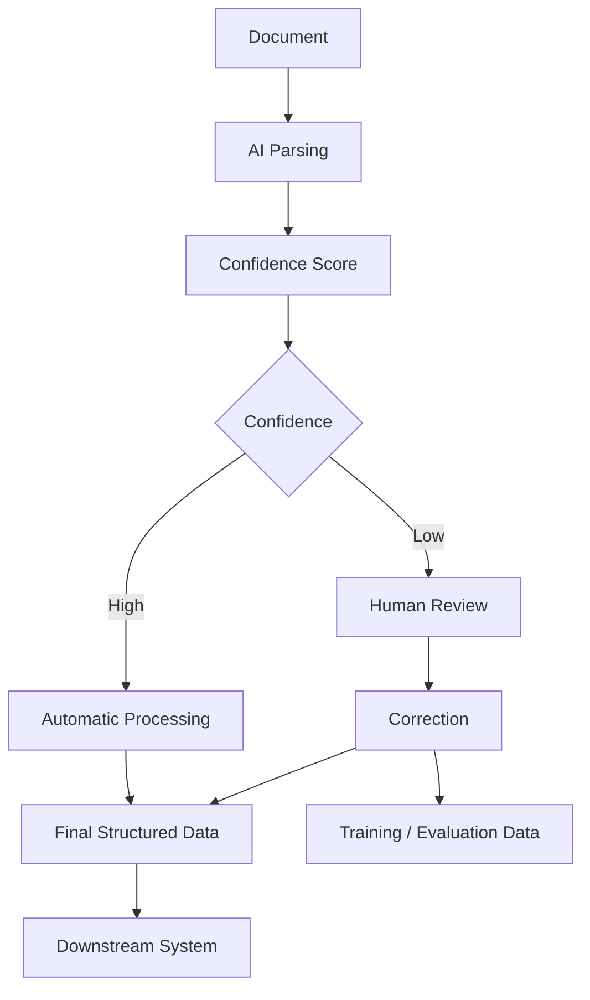
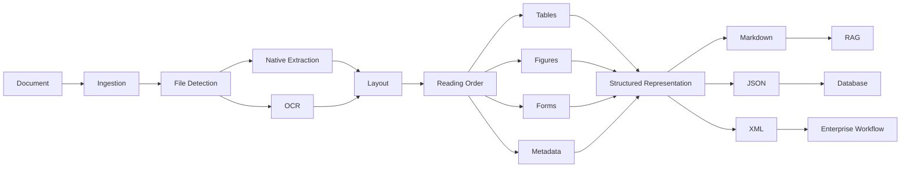

# Awesome-Document-Parsing-AI

# 📄 Top Document Parsing AI


> A curated list of **Document Parsing AI / Intelligent Document Processing (IDP)** platforms and open-source alternatives for extracting text, tables, layouts, forms, key-value pairs, handwriting, figures, formulas, metadata and structured information from PDFs, scanned documents, images and office files.


Modern Document Parsing AI goes far beyond OCR. It combines **OCR, document layout analysis, table extraction, reading-order detection, document classification, key-value extraction, handwriting recognition, vision-language models, structured output and LLM-ready document understanding**.


This repository focuses primarily on **open-source software** that can be self-hosted to build alternatives to commercial platforms such as LlamaParse, Unstructured, Google Document AI, Azure AI Document Intelligence, Amazon Textract, Veryfi, Nanonets, Rossum, Parseur and Klippa.


---


## 📑 Table of Contents


* [☁️ SaaS/Hosted Platforms](#️-saashosted-platforms)

* [🌍 Open-Source](#-open-source)

* [📄 Open-Source Document Parsing Platforms](#-open-source-document-parsing-platforms)

* [👁️ Open-Source OCR](#️-open-source-ocr)

* [🧠 Open-Source AI Document Understanding](#-open-source-ai-document-understanding)

* [📐 Open-Source Layout Analysis](#-open-source-layout-analysis)

* [📊 Open-Source Table Extraction](#-open-source-table-extraction)

* [🧾 Open-Source Forms & Key-Value Extraction](#-open-source-forms--key-value-extraction)

* [🔬 Open-Source Scientific & Technical Document Parsing](#-open-source-scientific--technical-document-parsing)

* [📑 Open-Source PDF & Office Document Processing](#-open-source-pdf--office-document-processing)

* [🔄 Open-Source Document-to-Markdown](#-open-source-document-to-markdown)

* [🤖 Open-Source Document VLMs](#-open-source-document-vlms)

* [🏗️ Open-Source Document Processing Infrastructure](#️-open-source-document-processing-infrastructure)

* [🧩 Commercial Platform → Open-Source Equivalent](#-commercial-platform--open-source-equivalent)

* [🏗️ Enterprise Document Parsing Architecture](#️-enterprise-document-parsing-architecture)

* [🔄 Open-Source Document Parsing Architecture](#-open-source-document-parsing-architecture)

* [⚖️ Commercial vs Open-Source](#️-commercial-vs-open-source)

* [🚀 Recommended Open-Source Stacks](#-recommended-open-source-stacks)

* [🔬 Document Parsing Pipeline](#-document-parsing-pipeline)

* [📊 Document Parsing Technology Comparison](#-document-parsing-technology-comparison)

* [🎯 Recommended Projects by Use Case](#-recommended-projects-by-use-case)

* [🌐 Open-Source Document AI Landscape](#-open-source-document-ai-landscape)

* [🤝 Contributing](#-contributing)

* [⚠️ Disclaimer](#️-disclaimer)


---


# ☁️ SaaS/Hosted Platforms


Commercial Document Parsing AI platforms provide managed OCR, layout analysis, table extraction, document classification, forms processing, structured extraction, human review and enterprise integrations.


| Platform                                                                                                    | Company             | Primary Focus                   | Key Capabilities                                                                    |

| ----------------------------------------------------------------------------------------------------------- | ------------------- | ------------------------------- | ----------------------------------------------------------------------------------- |

| [LlamaParse](https://www.llamaindex.ai/llamaparse)                                                          | LlamaIndex          | AI Document Parsing             | PDF parsing, tables, layouts, OCR, multimodal parsing, Markdown/structured output   |

| [Unstructured](https://unstructured.io/)                                                                    | Unstructured        | Document Processing             | ETL, partitioning, OCR, document elements, chunking, RAG pipelines                  |

| [Google Document AI](https://cloud.google.com/document-ai)                                                  | Google Cloud        | Intelligent Document Processing | OCR, classification, extraction, forms, invoices, layout and specialized processors |

| [Azure AI Document Intelligence](https://azure.microsoft.com/products/ai-services/ai-document-intelligence) | Microsoft           | Document Intelligence           | OCR, forms, invoices, receipts, tables, key-value pairs, custom extraction          |

| [Amazon Textract](https://aws.amazon.com/textract/)                                                         | AWS                 | OCR & Document Analysis         | Text, forms, tables, queries, signatures, layout and structured extraction          |

| [Veryfi](https://www.veryfi.com/)                                                                           | Veryfi              | Financial Document AI           | Invoices, receipts, bills, bank statements, OCR and structured extraction           |

| [Nanonets](https://nanonets.com/)                                                                           | Nanonets            | Intelligent Document Processing | OCR, invoices, receipts, forms, workflows, classification and extraction            |

| [Rossum](https://rossum.ai/)                                                                                | Rossum              | Intelligent Document Processing | Invoice/AP automation, document understanding, validation and workflows             |

| [Parseur](https://parseur.com/)                                                                             | Parseur             | Document & Email Parsing        | PDF, email and document extraction, OCR, templates and automated workflows          |

| [Klippa](https://www.klippa.com/)                                                                           | Klippa              | Document AI                     | OCR, ID documents, invoices, forms, receipts, classification and extraction         |

| [ABBYY Vantage](https://www.abbyy.com/vantage/)                                                             | ABBYY               | Intelligent Document Processing | OCR, classification, extraction, document skills and enterprise automation          |

| [Hyperscience](https://www.hyperscience.com/)                                                               | Hyperscience        | Hyperautomation / IDP           | Document processing, classification, extraction and human-in-the-loop automation    |

| [Docsumo](https://www.docsumo.com/)                                                                         | Docsumo             | Document AI                     | OCR, invoices, financial documents, forms and data extraction                       |

| [Mindee](https://www.mindee.com/)                                                                           | Mindee              | Document Parsing APIs           | OCR, invoices, receipts, passports, IDs and custom document extraction              |

| [Affinda](https://www.affinda.com/)                                                                         | Affinda             | Document Extraction             | Resumes, invoices, documents, OCR and structured data                               |

| [Rossum](https://rossum.ai/)                                                                                | Rossum              | Transactional Document AI       | Invoices, purchase orders, receipts and enterprise workflows                        |

| [Hypatos](https://hypatos.ai/)                                                                              | Hypatos             | Intelligent Document Processing | Accounts payable, invoices, receipts and financial document automation              |

| [Docugami](https://www.docugami.com/)                                                                       | Docugami            | Document Engineering            | Unstructured documents, semantic XML, document understanding and automation         |

| [Instabase](https://instabase.com/)                                                                         | Instabase           | AI Document Processing          | Enterprise document processing, extraction and workflow automation                  |

| [Ephesoft](https://www.ephesoft.com/)                                                                       | Ephesoft            | Intelligent Document Processing | Classification, OCR, extraction and document workflows                              |

| [Indico Data](https://indicodata.ai/)                                                                       | Indico Data         | Unstructured Data Automation    | Document extraction, classification and AI workflows                                |

| [Kofax / Tungsten Automation](https://www.tungstenautomation.com/)                                          | Tungsten Automation | Intelligent Automation          | OCR, document capture, classification and extraction                                |

| [Hyperscience](https://www.hyperscience.com/)                                                               | Hyperscience        | IDP                             | Document processing and enterprise automation                                       |

| [Rossum](https://rossum.ai/)                                                                                | Rossum              | AI Document Processing          | Transactional document understanding and automation                                 |


---


# 🌍 Open-Source


Open-source Document Parsing AI is increasingly capable of replacing individual components of commercial IDP platforms.


Instead of one monolithic product, the open-source ecosystem provides specialized components:


```text

                    Document

                       │

                       ▼

              ┌─────────────────┐

              │   File Parser   │

              └────────┬────────┘

                       │

                       ▼

              ┌─────────────────┐

              │       OCR       │

              └────────┬────────┘

                       │

                       ▼

              ┌─────────────────┐

              │ Layout Analysis │

              └────────┬────────┘

                       │

             ┌─────────┼─────────┐

             │         │         │

             ▼         ▼         ▼

          Tables     Forms     Figures

             │         │         │

             └─────────┼─────────┘

                       │

                       ▼

              Structured Output

                       │

                       ▼

                  Markdown

                 / JSON / XML

                       │

                       ▼

                 LLM / RAG / ETL

```


The most powerful open-source solutions increasingly combine **OCR + layout models + table extraction + vision-language models + structured output**.


---


# 📄 Open-Source Document Parsing Platforms


| Project                                                            | License                                     | Description                                                                                                        |

| ------------------------------------------------------------------ | ------------------------------------------- | ------------------------------------------------------------------------------------------------------------------ |

| [Docling](https://github.com/docling-project/docling)              | MIT                                         | Document conversion and AI parsing for PDF, DOCX, PPTX, XLSX, images and more; structured Markdown/JSON output     |

| [PaddleOCR](https://github.com/PaddlePaddle/PaddleOCR)             | Apache-2.0                                  | Large-scale OCR and Document AI toolkit supporting structured document parsing, tables, layouts and 100+ languages |

| [MinerU](https://github.com/opendatalab/MinerU)                    | Custom Apache-2.0-based Open Source License | Complex PDF/Office document parsing into LLM-ready Markdown/JSON                                                   |

| [Unstructured](https://github.com/Unstructured-IO/unstructured)    | Apache-2.0                                  | Document ingestion, partitioning and preprocessing framework for AI/RAG                                            |

| [Marker](https://github.com/datalab-to/marker)                     | Apache-2.0 code + separate model terms      | High-quality PDF-to-Markdown/JSON conversion using deep-learning document models                                   |

| [olmOCR](https://github.com/allenai/olmocr)                        | Apache-2.0                                  | Vision-language-model-based PDF linearization and OCR toolkit                                                      |

| [Surya](https://github.com/datalab-to/surya)                       | GPL code + separate model terms             | OCR, layout analysis, reading order and table recognition                                                          |

| [MarkItDown](https://github.com/microsoft/markitdown)              | MIT                                         | Converts many document formats into Markdown for LLM and text-analysis workflows                                   |

| [Apache Tika](https://tika.apache.org/)                            | Apache-2.0                                  | Universal content detection, metadata extraction and text extraction toolkit                                       |

| [GROBID](https://github.com/kermitt2/grobid)                       | Apache-2.0                                  | Machine-learning library for extracting structured metadata and full text from scholarly PDFs                      |

| [Nougat](https://github.com/facebookresearch/nougat)               | MIT code + model-specific terms             | Neural OCR for academic/scientific documents                                                                       |

| [Deepdoctection](https://github.com/deepdoctection/deepdoctection) | Apache-2.0                                  | Document layout analysis, OCR and table extraction framework                                                       |

| [LayoutParser](https://github.com/Layout-Parser/layout-parser)     | Apache-2.0                                  | Toolkit for document image analysis and layout detection                                                           |

| [PaddleOCR-VL](https://github.com/PaddlePaddle/PaddleOCR)          | Apache-2.0                                  | Compact document vision-language models for document parsing                                                       |

| [DocTR](https://github.com/mindee/doctr)                           | Apache-2.0                                  | Deep-learning OCR library for text detection and recognition                                                       |

| [OCRmyPDF](https://github.com/ocrmypdf/OCRmyPDF)                   | MPL-2.0                                     | Adds searchable OCR layers to scanned PDFs                                                                         |

| [Umi-OCR](https://github.com/hiroi-sora/Umi-OCR)                   | AGPL-3.0                                    | Offline OCR application supporting batch document/image OCR                                                        |


---


# 👁️ Open-Source OCR


OCR remains the foundation of Document AI for scanned PDFs, images, forms and photographs.


| Project                                                     | License           | Languages / Focus         | Description                                               |

| ----------------------------------------------------------- | ----------------- | ------------------------- | --------------------------------------------------------- |

| [PaddleOCR](https://github.com/PaddlePaddle/PaddleOCR)      | Apache-2.0        | 100+ languages            | Production-grade OCR and Document AI                      |

| [Tesseract OCR](https://github.com/tesseract-ocr/tesseract) | Apache-2.0        | 100+ languages            | Mature open-source OCR engine                             |

| [Surya](https://github.com/datalab-to/surya)                | GPL + model terms | 90+ languages             | OCR, text detection, layout and reading order             |

| [docTR](https://github.com/mindee/doctr)                    | Apache-2.0        | Multilingual              | Deep-learning OCR                                         |

| [EasyOCR](https://github.com/JaidedAI/EasyOCR)              | Apache-2.0        | 80+ languages             | Easy-to-use deep-learning OCR                             |

| [RapidOCR](https://github.com/RapidAI/RapidOCR)             | Apache-2.0        | Multilingual              | Lightweight OCR deployment toolkit                        |

| [keras-ocr](https://github.com/faustomorales/keras-ocr)     | MIT               | General OCR               | Keras-based OCR pipeline                                  |

| [MMOCR](https://github.com/open-mmlab/mmocr)                | Apache-2.0        | Multilingual              | OpenMMLab OCR toolbox                                     |

| [Calamari OCR](https://github.com/Calamari-OCR/calamari)    | Apache-2.0        | Historical / general      | OCR framework for training and inference                  |

| [Kraken](https://github.com/mittagessen/kraken)             | Apache-2.0        | Historical / multilingual | OCR engine optimized for complex and historical documents |

| [OCRmyPDF](https://github.com/ocrmypdf/OCRmyPDF)            | MPL-2.0           | PDF                       | OCR layer generation for scanned PDFs                     |

| [GOCR](https://jocr.sourceforge.net/)                       | GPL-2.0           | General                   | Lightweight OCR engine                                    |


---


# 🧠 Open-Source AI Document Understanding


These projects go beyond character recognition by understanding **what the document contains and how its elements relate to one another**.


| Project                                                            | License                       | Main Capability                                                  |

| ------------------------------------------------------------------ | ----------------------------- | ---------------------------------------------------------------- |

| [PaddleOCR](https://github.com/PaddlePaddle/PaddleOCR)             | Apache-2.0                    | OCR + layout + tables + document parsing                         |

| [Docling](https://github.com/docling-project/docling)              | MIT                           | Document structure, reading order, tables and multimodal parsing |

| [MinerU](https://github.com/opendatalab/MinerU)                    | Custom Apache-2.0-based       | PDF understanding, tables, formulas, images and Markdown         |

| [Marker](https://github.com/datalab-to/marker)                     | Apache-2.0 code + model terms | PDF understanding and structured conversion                      |

| [olmOCR](https://github.com/allenai/olmocr)                        | Apache-2.0                    | VLM-powered PDF understanding                                    |

| [Surya](https://github.com/datalab-to/surya)                       | GPL + model terms             | OCR + layout + reading order + tables                            |

| [Deepdoctection](https://github.com/deepdoctection/deepdoctection) | Apache-2.0                    | Modular document-analysis framework                              |

| [LayoutParser](https://github.com/Layout-Parser/layout-parser)     | Apache-2.0                    | Document layout understanding                                    |

| [Unstructured](https://github.com/Unstructured-IO/unstructured)    | Apache-2.0                    | Document partitioning and semantic elements                      |

| [GROBID](https://github.com/kermitt2/grobid)                       | Apache-2.0                    | Scholarly document understanding                                 |

| [Nougat](https://github.com/facebookresearch/nougat)               | MIT code + model terms        | Scientific document understanding                                |


---


# 📐 Open-Source Layout Analysis


Layout analysis identifies document regions such as:


```text

┌──────────────────────────────────────┐

│              TITLE                   │

├───────────────────┬──────────────────┤

│                   │                  │

│     Paragraph     │      Figure      │

│                   │                  │

├───────────────────┴──────────────────┤

│              Table                   │

├──────────────────────────────────────┤

│             Paragraph                │

└──────────────────────────────────────┘

```


| Project                                                             | License               | Capabilities                                              |

| ------------------------------------------------------------------- | --------------------- | --------------------------------------------------------- |

| [LayoutParser](https://github.com/Layout-Parser/layout-parser)      | Apache-2.0            | Layout detection and document image analysis              |

| [Surya](https://github.com/datalab-to/surya)                        | GPL + model terms     | Layout, reading order, tables and OCR                     |

| [PaddleOCR PP-Structure](https://github.com/PaddlePaddle/PaddleOCR) | Apache-2.0            | Layout analysis and document structure                    |

| [Docling](https://github.com/docling-project/docling)               | MIT                   | Reading order and document hierarchy                      |

| [Deepdoctection](https://github.com/deepdoctection/deepdoctection)  | Apache-2.0            | Layout, OCR and table detection                           |

| [Detectron2](https://github.com/facebookresearch/detectron2)        | Apache-2.0            | General object detection and segmentation framework       |

| [MMDetection](https://github.com/open-mmlab/mmdetection)            | Apache-2.0            | Computer-vision detection framework                       |

| [YOLO](https://github.com/ultralytics/ultralytics)                  | AGPL-3.0 / Enterprise | Object detection useful for custom document-layout models |


---


# 📊 Open-Source Table Extraction


Tables are one of the hardest parts of document parsing because visual structure is often lost during ordinary OCR.


| Project                                                             | License               | Description                                      |

| ------------------------------------------------------------------- | --------------------- | ------------------------------------------------ |

| [PaddleOCR PP-Structure](https://github.com/PaddlePaddle/PaddleOCR) | Apache-2.0            | Table detection and structured table recognition |

| [Docling](https://github.com/docling-project/docling)               | MIT                   | TableFormer-based table structure extraction     |

| [Camelot](https://github.com/camelot-dev/camelot)                   | MIT                   | PDF table extraction                             |

| [Tabula](https://github.com/tabulapdf/tabula)                       | MIT                   | Extracts tables from PDFs                        |

| [pdfplumber](https://github.com/jsvine/pdfplumber)                  | MIT                   | PDF text, geometry and table extraction          |

| [PyMuPDF](https://github.com/pymupdf/PyMuPDF)                       | AGPL-3.0 / Commercial | PDF rendering, text and table-related extraction |

| [Excalibur](https://github.com/camelot-dev/excalibur)               | MIT                   | Web interface for Camelot                        |

| [Deepdoctection](https://github.com/deepdoctection/deepdoctection)  | Apache-2.0            | Table detection and structure recognition        |

| [Surya](https://github.com/datalab-to/surya)                        | GPL + model terms     | Table recognition                                |


---


# 🧾 Open-Source Forms & Key-Value Extraction


Forms and invoices require understanding relationships between labels and values.


```text

Invoice Number:       INV-2026-00124

Invoice Date:         2026-09-10

Vendor:               ACME Corporation


Subtotal:             $1,200.00

Tax:                  $216.00

Total:                $1,416.00

```


Useful projects:


| Project                                                                 | Description                                       |

| ----------------------------------------------------------------------- | ------------------------------------------------- |

| [PaddleOCR](https://github.com/PaddlePaddle/PaddleOCR)                  | Document structure and key information extraction |

| [LayoutParser](https://github.com/Layout-Parser/layout-parser)          | Layout-based document analysis                    |

| [Deepdoctection](https://github.com/deepdoctection/deepdoctection)      | Modular forms, tables and document analysis       |

| [Unstructured](https://github.com/Unstructured-IO/unstructured)         | Structured document elements and partitioning     |

| [Docling](https://github.com/docling-project/docling)                   | Structured document representation                |

| [LayoutLM](https://github.com/microsoft/unilm/tree/master/layoutlm)     | Layout-aware document understanding research      |

| [LayoutLMv2](https://github.com/microsoft/unilm/tree/master/layoutlmv2) | Multimodal document understanding                 |

| [LayoutLMv3](https://github.com/microsoft/unilm/tree/master/layoutlmv3) | Unified text/image/layout document understanding  |

| [Donut](https://github.com/clovaai/donut)                               | OCR-free document understanding                   |

| [LiLT](https://github.com/jpWang/LiLT)                                  | Language-independent layout transformer           |


---


# 🔬 Open-Source Scientific & Technical Document Parsing


Scientific PDFs require specialized handling for equations, references, citations, tables and multi-column layouts.


| Project                                               | License                       | Description                                                                |

| ----------------------------------------------------- | ----------------------------- | -------------------------------------------------------------------------- |

| [GROBID](https://github.com/kermitt2/grobid)          | Apache-2.0                    | Extracts structured metadata, references and full text from scholarly PDFs |

| [Nougat](https://github.com/facebookresearch/nougat)  | MIT code + model terms        | Neural scientific document parsing                                         |

| [Marker](https://github.com/datalab-to/marker)        | Apache-2.0 code + model terms | PDF-to-Markdown with formulas and structure                                |

| [Docling](https://github.com/docling-project/docling) | MIT                           | Scientific PDF parsing, tables and formulas                                |

| [MinerU](https://github.com/opendatalab/MinerU)       | Custom Apache-2.0-based       | Complex PDF parsing, formulas and tables                                   |

| [olmOCR](https://github.com/allenai/olmocr)           | Apache-2.0                    | VLM-based PDF linearization                                                |

| [LaTeXML](https://github.com/brucemiller/LaTeXML)     | CPAL-1.0                      | Converts LaTeX and TeX documents to XML/HTML                               |

| [CERMINE](https://github.com/CeON/CERMINE)            | Apache-2.0                    | Scientific publication metadata and structure extraction                   |


---


# 📑 Open-Source PDF & Office Document Processing


| Project                                                      | License               | Description                                             |

| ------------------------------------------------------------ | --------------------- | ------------------------------------------------------- |

| [Apache Tika](https://tika.apache.org/)                      | Apache-2.0            | Extracts text and metadata from thousands of file types |

| [PyMuPDF](https://github.com/pymupdf/PyMuPDF)                | AGPL-3.0 / Commercial | Fast PDF processing library                             |

| [pypdf](https://github.com/py-pdf/pypdf)                     | BSD-3-Clause          | Python PDF manipulation and extraction                  |

| [pdfplumber](https://github.com/jsvine/pdfplumber)           | MIT                   | PDF text, geometry and tables                           |

| [PDFMiner.six](https://github.com/pdfminer/pdfminer.six)     | MIT                   | PDF text and layout extraction                          |

| [Apache PDFBox](https://pdfbox.apache.org/)                  | Apache-2.0            | Java PDF processing                                     |

| [python-docx](https://github.com/python-openxml/python-docx) | MIT                   | DOCX processing                                         |

| [python-pptx](https://github.com/scanny/python-pptx)         | MIT                   | PowerPoint processing                                   |

| [openpyxl](https://github.com/ericgazoni/openpyxl)           | MIT                   | Excel processing                                        |

| [python-magic](https://github.com/ahupp/python-magic)        | MIT                   | File type detection                                     |

| [LibreOffice](https://www.libreoffice.org/)                  | MPL-2.0               | Broad office document conversion                        |

| [Pandoc](https://github.com/jgm/pandoc)                      | GPL-2.0               | Universal document conversion                           |


---


# 🔄 Open-Source Document-to-Markdown


Markdown has become a particularly useful intermediate format for **RAG and LLM applications**.


| Project                                                         | License                       | Primary Use                            |

| --------------------------------------------------------------- | ----------------------------- | -------------------------------------- |

| [Docling](https://github.com/docling-project/docling)           | MIT                           | PDF/Office/image → structured Markdown |

| [MinerU](https://github.com/opendatalab/MinerU)                 | Custom Apache-2.0-based       | Complex PDF → Markdown/JSON            |

| [Marker](https://github.com/datalab-to/marker)                  | Apache-2.0 code + model terms | PDF → Markdown/JSON                    |

| [PaddleOCR](https://github.com/PaddlePaddle/PaddleOCR)          | Apache-2.0                    | PDF/image → Markdown/JSON              |

| [MarkItDown](https://github.com/microsoft/markitdown)           | MIT                           | Office/PDF/image → Markdown            |

| [olmOCR](https://github.com/allenai/olmocr)                     | Apache-2.0                    | PDF → LLM-friendly text                |

| [Unstructured](https://github.com/Unstructured-IO/unstructured) | Apache-2.0                    | Documents → structured elements        |

| [GROBID](https://github.com/kermitt2/grobid)                    | Apache-2.0                    | Scientific PDF → structured TEI XML    |


### Why Markdown?


```text

PDF

 │

 ▼

Document Parser

 │

 ▼

Structured Markdown

 │

 ├── Headings

 ├── Paragraphs

 ├── Tables

 ├── Lists

 ├── Equations

 ├── Figures

 └── Metadata

 │

 ▼

Chunking

 │

 ▼

Embeddings

 │

 ▼

Vector Database

 │

 ▼

RAG

```


---


# 🤖 Open-Source Document VLMs


Vision-language models are increasingly replacing traditional OCR pipelines for complex documents.


| Project / Model                                                         | Description                                                     |

| ----------------------------------------------------------------------- | --------------------------------------------------------------- |

| [PaddleOCR-VL](https://github.com/PaddlePaddle/PaddleOCR)               | Compact VLM designed specifically for document parsing          |

| [olmOCR](https://github.com/allenai/olmocr)                             | VLM-powered PDF OCR and linearization                           |

| [Donut](https://github.com/clovaai/donut)                               | OCR-free document understanding                                 |

| [LayoutLMv3](https://github.com/microsoft/unilm/tree/master/layoutlmv3) | Multimodal text + image + layout model                          |

| [Nougat](https://github.com/facebookresearch/nougat)                    | Neural model for scientific document parsing                    |

| [Qwen-VL](https://github.com/QwenLM/Qwen3-VL)                           | General multimodal model usable for document understanding      |

| [InternVL](https://github.com/OpenGVLab/InternVL)                       | Open multimodal model family                                    |

| [LLaVA](https://github.com/haotian-liu/LLaVA)                           | Open multimodal LLM framework                                   |

| [Florence-2](https://github.com/InternLM/Florence-2)                    | Vision foundation model useful for visual understanding         |

| [MiniCPM-V](https://github.com/OpenBMB/MiniCPM-V)                       | Compact multimodal models suitable for local document workflows |


---


# 🏗️ Open-Source Document Processing Infrastructure


| Component           | Open-Source Options                               |

| ------------------- | ------------------------------------------------- |

| File Detection      | Apache Tika, libmagic                             |

| PDF                 | PDFBox, PyMuPDF, pypdf, PDFMiner                  |

| Office              | LibreOffice, python-docx, python-pptx, openpyxl   |

| OCR                 | PaddleOCR, Tesseract, Surya, EasyOCR              |

| Layout              | LayoutParser, Surya, PP-Structure, Deepdoctection |

| Tables              | Camelot, Tabula, Docling, PaddleOCR               |

| Scientific PDFs     | GROBID, Nougat, Marker                            |

| Document Parsing    | Docling, MinerU, Unstructured, Marker             |

| Markdown Conversion | Docling, MarkItDown, MinerU, Marker               |

| Image Processing    | OpenCV, Pillow                                    |

| VLM                 | PaddleOCR-VL, Qwen-VL, InternVL, Donut            |

| Queues              | RabbitMQ, Kafka, Redis                            |

| API                 | FastAPI, Flask, Go                                |

| Storage             | PostgreSQL, MinIO, S3-compatible storage          |

| Search              | OpenSearch, Apache Solr, Vespa                    |

| Vector DB           | Qdrant, Milvus, pgvector                          |

| Observability       | OpenTelemetry, Prometheus, Grafana                |


---


# 🧩 Commercial Platform → Open-Source Equivalent


| Commercial Platform                | Open-Source Building Blocks                                                      |

| ---------------------------------- | -------------------------------------------------------------------------------- |

| **LlamaParse**                     | Docling + MinerU + PaddleOCR + Marker + LlamaIndex                               |

| **Unstructured**                   | Apache Tika + Docling + PaddleOCR + custom partitioning                          |

| **Google Document AI**             | PaddleOCR + Docling + LayoutParser + VLM + custom extraction                     |

| **Azure AI Document Intelligence** | PaddleOCR + Docling + LayoutLM + Deepdoctection                                  |

| **Amazon Textract**                | PaddleOCR + Tesseract + LayoutParser + table extraction                          |

| **Veryfi**                         | PaddleOCR + Docling + document classification + custom financial extraction      |

| **Nanonets**                       | PaddleOCR + LayoutLM + Docling + custom document models                          |

| **Rossum**                         | PaddleOCR + Docling + LayoutLM + workflow engine                                 |

| **Parseur**                        | Apache Tika + Docling + OCR + custom extraction rules                            |

| **Klippa**                         | PaddleOCR + LayoutLM + Docling + document classifiers                            |

| **ABBYY Vantage**                  | Tesseract/PaddleOCR + LayoutParser + custom ML models                            |

| **Hyperscience**                   | PaddleOCR + Layout analysis + VLM + workflow/orchestration                       |

| **Mindee**                         | PaddleOCR + Docling + specialized document models                                |

| **Docsumo**                        | PaddleOCR + LayoutLM + custom extraction models                                  |

| **GROBID**                         | GROBID itself for scholarly documents; Docling/Marker for broader document types |


---


# 🏗️ Enterprise Document Parsing Architecture





---


# 🔄 Open-Source Document Parsing Architecture





---


# 🧠 Modern AI Document Parsing Pipeline


Traditional OCR:


```text

Document

   ↓

OCR

   ↓

Text

```


Modern Document AI:


```text

Document

   ↓

OCR / VLM

   ↓

Layout Analysis

   ↓

Reading Order

   ↓

Tables

   ↓

Figures

   ↓

Forms

   ↓

Semantic Understanding

   ↓

Structured Representation

   ↓

Markdown / JSON

   ↓

LLM / RAG / Automation

```


---


# 📊 Document Parsing Technology Comparison


| Project      |   OCR   |  Layout |  Tables |  Forms  | Markdown |   JSON  |    VLM   |   Multilingual  |

| ------------ | :-----: | :-----: | :-----: | :-----: | :------: | :-----: | :------: | :-------------: |

| Docling      |    ✅    |    ✅    |    ✅    | Partial |     ✅    |    ✅    | Optional |        ✅        |

| PaddleOCR    |    ✅    |    ✅    |    ✅    |    ✅    |     ✅    |    ✅    |     ✅    |        ✅        |

| MinerU       |    ✅    |    ✅    |    ✅    | Partial |     ✅    |    ✅    |     ✅    |        ✅        |

| Marker       |    ✅    |    ✅    |    ✅    | Partial |     ✅    |    ✅    | Optional |     Partial     |

| Unstructured |    ✅    |    ✅    | Partial | Partial |  Partial |    ✅    | Optional |        ✅        |

| Surya        |    ✅    |    ✅    |    ✅    | Partial |  Partial |    ✅    |     ❌    |        ✅        |

| olmOCR       |    ✅    |    ✅    | Partial | Partial |     ✅    | Partial |     ✅    |     Partial     |

| Apache Tika  | Partial |    ❌    | Partial |    ❌    |  Partial | Partial |     ❌    |     Partial     |

| GROBID       | Partial |    ✅    | Partial |    ❌    |  Partial |    ✅    |     ❌    |     Partial     |

| Nougat       |    ✅    | Partial | Partial |    ❌    |     ✅    | Partial |  Neural  |    Scientific   |

| MarkItDown   | Partial | Partial | Partial |    ❌    |     ✅    | Partial | Optional |     Partial     |

| LayoutParser | Partial |    ✅    | Partial | Partial |     ❌    |    ✅    |     ❌    | Model-dependent |


---


# 🎯 Recommended Projects by Use Case


| Use Case                              | Recommended Starting Point                 |

| ------------------------------------- | ------------------------------------------ |

| Best general-purpose document parsing | **Docling**                                |

| Best broad OCR + Document AI          | **PaddleOCR**                              |

| Complex PDF → Markdown                | **MinerU**                                 |

| High-quality PDF → Markdown           | **Marker**                                 |

| LLM-oriented PDF OCR                  | **olmOCR**                                 |

| Enterprise document ingestion         | **Unstructured**                           |

| Universal file extraction             | **Apache Tika**                            |

| Scientific papers                     | **GROBID / Nougat**                        |

| OCR                                   | **PaddleOCR / Surya / Tesseract**          |

| Multilingual OCR                      | **PaddleOCR / Surya**                      |

| Tables                                | **PaddleOCR / Docling / Camelot**          |

| PDF tables                            | **Camelot / pdfplumber**                   |

| Layout detection                      | **Surya / LayoutParser / PP-Structure**    |

| Document-to-Markdown                  | **Docling / MinerU / Marker / MarkItDown** |

| Local/offline processing              | **Docling / PaddleOCR / MinerU**           |

| RAG ingestion                         | **Docling / Unstructured / MinerU**        |

| Scientific PDF extraction             | **GROBID**                                 |

| Search-engine ingestion               | **Apache Tika / Docling**                  |

| Lightweight office conversion         | **MarkItDown**                             |

| OCR PDF creation                      | **OCRmyPDF**                               |

| OCR-free document understanding       | **Donut**                                  |


---


# 🧪 Choosing Between the Major Open-Source Parsers


## Docling


Best suited for:


```text

Enterprise Documents

PDF

DOCX

PPTX

XLSX

Images

Tables

RAG

Markdown

JSON

```


Docling is particularly attractive when the objective is to preserve **document structure, reading order, tables and metadata** while producing AI-friendly output.


---


## PaddleOCR


Best suited for:


```text

OCR

Multilingual Documents

Scanned PDFs

Tables

Forms

Layout

Document VLMs

Production Inference

```


It is one of the broadest open-source Document AI ecosystems and is particularly strong when OCR and structured document parsing need to be combined.


---


## MinerU


Best suited for:


```text

Complex PDFs

Scientific Papers

Tables

Equations

Figures

Markdown

JSON

RAG

```


MinerU is especially useful for turning visually complex PDFs into structured, LLM-ready representations.


---


## Marker


Best suited for:


```text

PDF

Academic Papers

Books

Technical Documents

Markdown

JSON

```


Marker focuses heavily on high-quality PDF conversion and reconstruction of document structure.


---


## Unstructured


Best suited for:


```text

Enterprise ETL

Document Ingestion

RAG

Data Pipelines

Document Partitioning

Multiple File Types

```


It is particularly useful when document parsing is one stage inside a larger ingestion pipeline.


---


## Apache Tika


Best suited for:


```text

Universal File Detection

Metadata Extraction

Enterprise Search

Content Indexing

File-Type Handling

```


Tika is less of an AI document-understanding system and more of a foundational **content extraction layer**.


---


# 🧱 Building a LlamaParse Alternative


A practical open-source LlamaParse-like architecture:


```text

                         ┌───────────────────┐

                         │     PDF / File    │

                         └─────────┬─────────┘

                                   │

                                   ▼

                         ┌───────────────────┐

                         │   File Detection  │

                         └─────────┬─────────┘

                                   │

                       ┌───────────┴───────────┐

                       │                       │

                Native Text                 OCR

                       │                       │

                       └───────────┬───────────┘

                                   │

                                   ▼

                         ┌───────────────────┐

                         │ Layout Analysis   │

                         └─────────┬─────────┘

                                   │

                 ┌─────────────────┼─────────────────┐

                 │                 │                 │

              Tables           Figures           Text

                 │                 │                 │

                 └─────────────────┼─────────────────┘

                                   │

                                   ▼

                         ┌───────────────────┐

                         │ Structure Builder │

                         └─────────┬─────────┘

                                   │

                                   ▼

                         ┌───────────────────┐

                         │ Markdown / JSON   │

                         └─────────┬─────────┘

                                   │

                                   ▼

                              LLM / RAG

```


Recommended components:


```text

Docling

+

PaddleOCR

+

Surya

+

MinerU

+

Apache Tika

+

Qdrant / OpenSearch

```


---


# 🏢 Building an Azure Document Intelligence Alternative


```text

                    Document Upload

                          │

                          ▼

                     API Gateway

                          │

                          ▼

                 Document Classifier

                          │

            ┌─────────────┼─────────────┐

            │             │             │

           OCR          Layout        Tables

            │             │             │

            └─────────────┼─────────────┘

                          │

                          ▼

                  Key-Value Extraction

                          │

                          ▼

                    JSON Output

                          │

              ┌───────────┼───────────┐

              │           │           │

            RAG        Database      API

```


Possible implementation:


```text

FastAPI

+

PaddleOCR

+

Docling

+

LayoutParser

+

LayoutLM

+

PostgreSQL

+

Redis

```


---


# 🧾 Building an Amazon Textract Alternative


```text

Image / PDF

     │

     ▼

PaddleOCR / Tesseract

     │

     ▼

PP-Structure

     │

     ├── Text

     ├── Tables

     ├── Key-Value Pairs

     ├── Layout

     └── Selection Marks

     │

     ▼

Structured JSON

```


---


# 💼 Building a Veryfi / Nanonets / Rossum Alternative


Financial document processing requires more than OCR.


```text

Invoice

   │

   ▼

OCR

   │

   ▼

Document Classification

   │

   ▼

Layout Understanding

   │

   ▼

Vendor Detection

   │

   ├── Invoice Number

   ├── Date

   ├── Vendor

   ├── Customer

   ├── Line Items

   ├── Tax

   ├── Currency

   └── Total

   │

   ▼

Validation

   │

   ▼

Structured JSON

   │

   ▼

ERP / Accounting System

```


Possible open-source stack:


```text

PaddleOCR

+

Docling

+

LayoutLMv3

+

Document VLM

+

PostgreSQL

+

FastAPI

+

Human Review UI

```


---


# 🔐 Human-in-the-Loop Document AI


For production enterprise IDP, uncertain predictions should be routed to human review.





This architecture is particularly useful for:


* Invoices

* Insurance claims

* Tax documents

* Bank statements

* Purchase orders

* Customs documents

* Contracts

* Identity documents

* Medical documents


---


# ⚖️ Commercial vs Open-Source


| Capability              | SaaS Document AI    | Open-Source Stack            |

| ----------------------- | ------------------- | ---------------------------- |

| OCR                     | ✅                   | ✅                            |

| Layout Analysis         | ✅                   | ✅                            |

| Table Extraction        | ✅                   | ✅                            |

| Forms                   | ✅                   | ✅                            |

| Key-Value Extraction    | ✅                   | ✅                            |

| Handwriting             | Usually             | Possible                     |

| Document Classification | ✅                   | ✅                            |

| Custom Models           | Usually             | ✅                            |

| Markdown Output         | Increasingly common | Excellent                    |

| JSON Output             | ✅                   | ✅                            |

| RAG Integration         | ✅                   | Excellent                    |

| Human Review            | Usually integrated  | Build yourself               |

| Connectors              | Often extensive     | Build / integrate            |

| Data Privacy            | Vendor-dependent    | Full control                 |

| Self-Hosting            | Limited / varies    | ✅                            |

| Air-Gapped              | Limited             | ✅                            |

| Customization           | Medium–High         | Very High                    |

| Infrastructure          | Managed             | Self-managed                 |

| Cost                    | Usage-based         | Infrastructure + engineering |

| Vendor Lock-in          | Higher              | Lower                        |

| Source Code             | Usually unavailable | Available                    |

| Fine-Tuning             | Vendor-dependent    | Full control                 |

| Model Choice            | Vendor-dependent    | Open model ecosystem         |


---


# 🚀 Recommended Open-Source Stacks


## 1. 🏆 General Enterprise Document AI


```text

Docling

    +

PaddleOCR

    +

Surya

    +

PostgreSQL

    +

FastAPI

    +

Object Storage

```


Best general-purpose foundation.


---


## 2. 📚 RAG / LLM Document Parsing


```text

Docling

    +

MinerU

    +

PaddleOCR

    +

Qdrant

    +

LlamaIndex / Haystack

    +

vLLM

```


Best for converting enterprise documents into high-quality LLM context.


---


## 3. 📄 Complex PDF Parsing


```text

MinerU

    +

Docling

    +

PaddleOCR

    +

Surya

    +

Markdown / JSON

```


Excellent for:


* Research papers

* Technical PDFs

* Reports

* Books

* Multi-column documents

* Tables

* Equations


---


## 4. 🔬 Scientific Document Processing


```text

GROBID

    +

Nougat

    +

Docling

    +

Marker

    +

LaTeX / XML / Markdown

```


Best for academic and scientific literature.


---


## 5. 💰 Financial Document AI


```text

PaddleOCR

    +

Docling

    +

LayoutLMv3

    +

Document VLM

    +

PostgreSQL

    +

Human Review

```


Best for:


* Invoices

* Receipts

* Purchase orders

* Bank statements

* Financial reports


---


## 6. ⚡ High-Performance OCR


```text

PaddleOCR

    +

Surya

    +

GPU Inference

    +

FastAPI

    +

Redis

```


Best when throughput is more important than sophisticated semantic extraction.


---


# 🌐 Open-Source Document AI Landscape


```mermaid

mindmap

  root((Document Parsing AI))

    Document Parsers

      Docling

      MinerU

      Marker

      Unstructured

      Apache Tika

      MarkItDown

    OCR

      PaddleOCR

      Tesseract

      Surya

      EasyOCR

      docTR

      RapidOCR

    Layout

      LayoutParser

      Surya

      PP-Structure

      Deepdoctection

    Tables

      Camelot

      Tabula

      pdfplumber

      Docling

      PaddleOCR

    Scientific

      GROBID

      Nougat

      Marker

      LaTeXML

    Document VLM

      PaddleOCR-VL

      olmOCR

      Donut

      LayoutLM

      Qwen-VL

      InternVL

    Output

      Markdown

      JSON

      XML

      HTML

    Infrastructure

      FastAPI

      Redis

      PostgreSQL

      MinIO

      Kubernetes

    AI Applications

      RAG

      Search

      Agents

      ETL

      Automation

```


---


# 🔬 Document Parsing Pipeline





---


# 🧠 The Emerging Document AI Stack


The modern Document AI stack increasingly looks like:


```text

┌──────────────────────────────────────────────┐

│              AI Applications                │

│                                              │

│ RAG │ Search │ Agents │ Automation │ ETL    │

└──────────────────────┬───────────────────────┘

                       │

┌──────────────────────▼───────────────────────┐

│          Structured Document Layer           │

│                                              │

│ Markdown │ JSON │ XML │ DocTags │ HTML      │

└──────────────────────┬───────────────────────┘

                       │

┌──────────────────────▼───────────────────────┐

│        Document Understanding Layer          │

│                                              │

│ Layout │ Tables │ Forms │ Figures │ Reading  │

│ Order │ Classification │ Key-Value          │

└──────────────────────┬───────────────────────┘

                       │

┌──────────────────────▼───────────────────────┐

│              OCR / VLM Layer                 │

│                                              │

│ PaddleOCR │ Surya │ Tesseract │ VLMs        │

└──────────────────────┬───────────────────────┘

                       │

┌──────────────────────▼───────────────────────┐

│             Document Layer                  │

│                                              │

│ PDF │ DOCX │ PPTX │ XLSX │ Images │ HTML   │

└──────────────────────────────────────────────┘

```


---


# 🌟 Why Open-Source Document Parsing Matters


Commercial platforms package a large number of capabilities into one service:


```text

OCR

+

Layout Analysis

+

Tables

+

Forms

+

Classification

+

Extraction

+

Document VLM

+

Human Review

+

APIs

+

Workflows

```


The open-source ecosystem allows these capabilities to be assembled independently:


```text

PaddleOCR

      +

Docling

      +

MinerU

      +

Surya

      +

GROBID

      +

LayoutParser

      +

Open Models

      +

FastAPI

      +

PostgreSQL

      +

Object Storage

```


This enables:


* Full data ownership

* Self-hosting

* Private-cloud deployment

* Air-gapped processing

* Custom document models

* Custom OCR models

* Custom extraction schemas

* Custom document workflows

* Local inference

* Lower vendor lock-in

* Integration with existing RAG infrastructure

* Complete control over document-processing pipelines


---


# 🏆 Suggested Open-Source Reference Architecture


```text

                       ┌─────────────────────┐

                       │ Enterprise Documents│

                       └──────────┬──────────┘

                                  │

                       ┌──────────▼──────────┐

                       │ Ingestion / Storage │

                       └──────────┬──────────┘

                                  │

                       ┌──────────▼──────────┐

                       │   Apache Tika       │

                       │   File Detection    │

                       └──────────┬──────────┘

                                  │

                     ┌────────────┴────────────┐

                     │                         │

                Native Text                  OCR

                     │                         │

                     │              ┌──────────▼──────────┐

                     │              │ PaddleOCR / Surya  │

                     │              └──────────┬──────────┘

                     │                         │

                     └────────────┬────────────┘

                                  │

                       ┌──────────▼──────────┐

                       │ Docling / MinerU   │

                       │ / Unstructured     │

                       └──────────┬──────────┘

                                  │

                       ┌──────────▼──────────┐

                       │ Layout + Tables    │

                       └──────────┬──────────┘

                                  │

                       ┌──────────▼──────────┐

                       │ Document VLM       │

                       └──────────┬──────────┘

                                  │

                  ┌───────────────┼───────────────┐

                  │               │               │

               Markdown         JSON             XML

                  │               │               │

                  └───────────────┼───────────────┘

                                  │

              ┌───────────────────┼───────────────────┐

              │                   │                   │

             RAG                Search             ERP/API

```


---


# 🤝 Contributing


Contributions are welcome!


Please consider contributing:


* New Document AI platforms

* Open-source document parsers

* OCR engines

* Document VLMs

* Layout-analysis models

* Table extraction tools

* Form extraction systems

* Scientific document parsers

* PDF processing libraries

* Office document converters

* Document-to-Markdown tools

* RAG ingestion tools

* Benchmarks

* Dataset projects

* Human-in-the-loop systems

* Document AI deployment examples

* Architecture diagrams

* Tutorials


When adding an open-source project, please verify its **current license**, including separate licenses for model weights, code and commercial deployments where applicable.


---


# ⚠️ Disclaimer


This repository is an independent technical curation and is **not affiliated with or endorsed by any company or project listed here**.


Document parsing quality varies significantly according to document type, language, scan quality, layout complexity, tables, handwriting, formulas and model configuration.


Projects can also have different licenses for:


* Source code

* Model weights

* Training data

* Commercial use

* Hosted deployment

* Enterprise redistribution


Always verify the current license and terms of individual projects before using them commercially.


In particular, some modern document-parsing projects use **different licensing terms for code and model weights**. A project should not automatically be assumed to be unrestricted open source merely because its source repository is public.


---


## ⭐ Star This Repository


If you are interested in:


* Document AI

* Document Parsing

* Intelligent Document Processing

* OCR

* PDF Parsing

* Table Extraction

* Forms Processing

* Document VLMs

* Document-to-Markdown

* RAG

* Enterprise AI

* Open-Source AI


consider giving this repository a ⭐ **Star** and contributing new projects.


---


**Last updated: September 2026**
