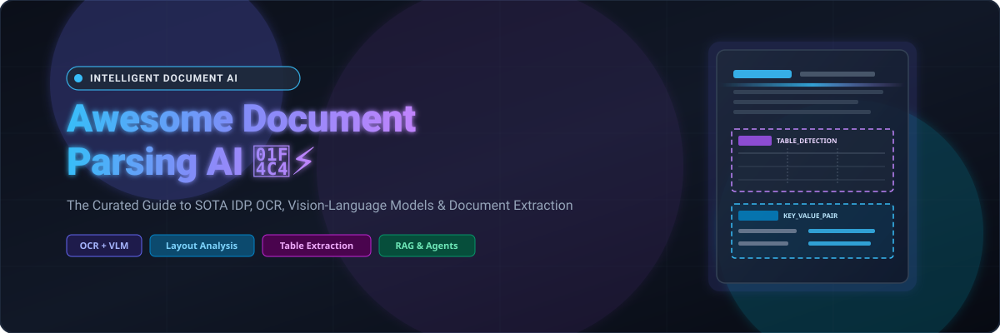
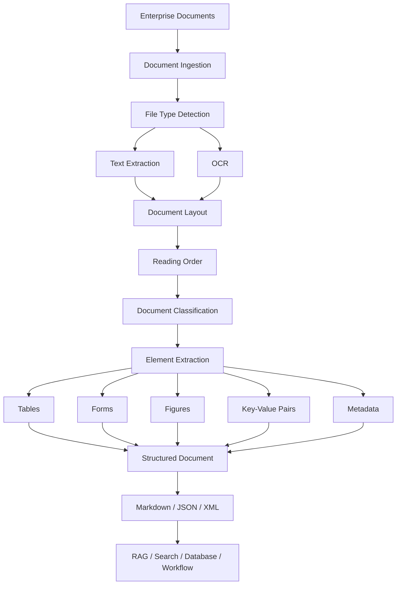
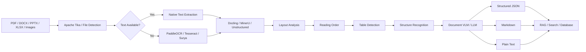
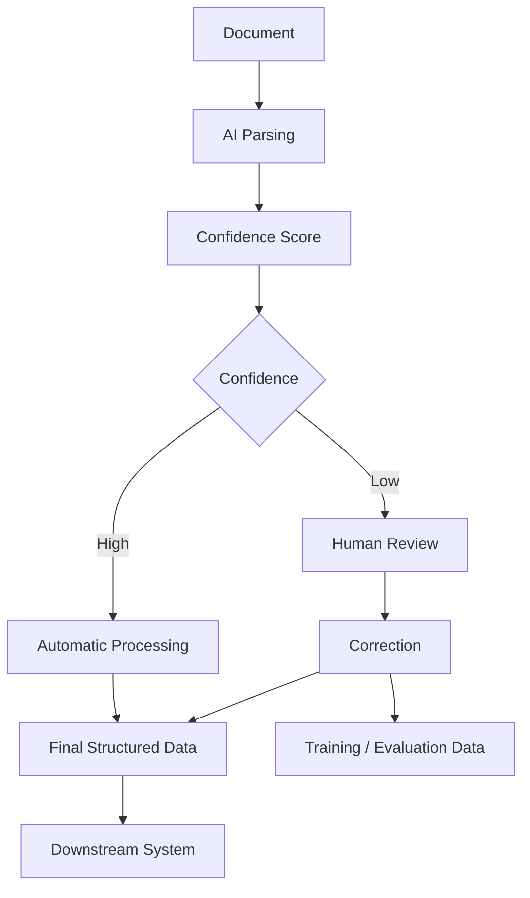
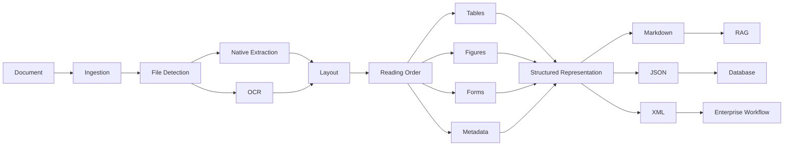

# 📄 Awesome Document Parsing AI & Intelligent Document Processing (IDP) ⚡

<p align="center">
  
</p>

<p align="center">
  <a href="https://github.com/ishandutta2007/Awesome-Awesome-Awesome"></a>
  <a href="https://discord.gg/jc4xtF58Ve"></a>
  <a href="https://github.com/ishandutta2007/Awesome-Document-Parsing-AI/stargazers"></a>
  <a href="https://github.com/ishandutta2007/Awesome-Document-Parsing-AI/network/members"></a>
  <a href="https://github.com/ishandutta2007/Awesome-Document-Parsing-AI/blob/main/LICENSE"></a>
  <a href="https://github.com/ishandutta2007/Awesome-Document-Parsing-AI/pulls"></a>
  <a href="https://github.com/ishandutta2007"></a>
</p>

> 🌟 **A comprehensive, SEO-optimized curated catalog of Intelligent Document Processing (IDP), Document Parsing AI, OCR engines, Vision-Language Models (VLMs), Layout Analysis, and Table Extraction frameworks.** Build high-performance pipelines for PDFs, scanned records, financial reports, academic literature, forms, and enterprise RAG applications.

---

## 🔍 Overview & Architecture

Modern **Document Parsing AI** goes far beyond traditional Optical Character Recognition (OCR). It unifies **OCR, document layout analysis, table extraction, reading-order detection, document classification, key-value extraction, handwriting recognition, vision-language models, structured output (Markdown/JSON), and LLM-ready document understanding**.

This repository curates both **commercial SaaS/hosted IDP solutions** and the leading **open-source software** that can be self-hosted to build cost-effective, private, and customizable alternatives to commercial platforms like LlamaParse, Unstructured, Google Document AI, Azure AI Document Intelligence, Amazon Textract, Veryfi, Nanonets, Rossum, Parseur, and Klippa.

---

## 📑 Table of Contents

* [☁️ SaaS & Hosted Platforms](#️-saas--hosted-platforms)
  * [📊 Market Size & Sector Dynamics](#-market-size--sector-dynamics)
  * [🏢 Commercial IDP Comparison Matrix](#-commercial-idp-comparison-matrix)
* [🌍 Open-Source Document AI Ecosystem](#-open-source-document-ai-ecosystem)
  * [📄 Open-Source Document Parsing Platforms](#-open-source-document-parsing-platforms)
  * [👁️ Open-Source OCR](#️-open-source-ocr)
  * [🧠 Open-Source AI Document Understanding](#-open-source-ai-document-understanding)
  * [📐 Open-Source Layout Analysis](#-open-source-layout-analysis)
  * [📊 Open-Source Table Extraction](#-open-source-table-extraction)
  * [🧾 Open-Source Forms & Key-Value Extraction](#-open-source-forms--key-value-extraction)
  * [🔬 Open-Source Scientific & Technical Document Parsing](#-open-source-scientific--technical-document-parsing)
  * [📑 Open-Source PDF & Office Document Processing](#-open-source-pdf--office-document-processing)
  * [🔄 Open-Source Document-to-Markdown](#-open-source-document-to-markdown)
  * [🤖 Open-Source Document VLMs](#-open-source-document-vlms)
* [🏗️ Enterprise Document Parsing Architecture](#️-enterprise-document-parsing-architecture)
* [🔄 Open-Source Document Parsing Architecture](#-open-source-document-parsing-architecture)
* [🧩 Commercial Platform → Open-Source Equivalent](#-commercial-platform--open-source-equivalent)
* [🚀 Recommended Open-Source Stacks](#-recommended-open-source-stacks)
* [⭐ Star History](#-star-history)
* [🤝 Contributing](#-contributing)
* [⚠️ Disclaimer](#️-disclaimer)

---

# ☁️ SaaS & Hosted Platforms

Commercial Document Parsing AI platforms provide fully managed OCR, layout analysis, table extraction, document classification, forms processing, structured extraction, human review, and enterprise integrations.

### 📊 Market Size & Sector Dynamics

> 💡 **Estimated Market Size & Industry Concentration:** The global **Intelligent Document Processing (IDP) and AI Document Parsing market** is estimated at **$2.5B – $3.8B in 2024–2025** and is projected to expand to **$12B – $15B by 2030–2032** (CAGR ~28–33%). The sector is **moderately fragmented** rather than winner-take-all: cloud hyperscalers (*Microsoft Azure, Google Cloud, AWS*) dominate high-throughput utility OCR and foundational model APIs, while a resilient mid-market of specialized vertical IDP platforms (*ABBYY, Hyperscience, Rossum, Kofax/Tungsten*) and modern LLM-native parsing engines (*LlamaIndex, Unstructured*) command high-value workflow automation, finance/insurance workflows, and RAG ingestion pipelines.

### 🏢 Commercial IDP Comparison Matrix

*The table below is sorted by **Company Size (Valuation / Market Cap / Revenue) descending**, providing starting tier pricing and specific free tier / trial terms for each service:*

| Platform | Company | Company Size (Valuation / Revenue) | Primary Focus | Key Capabilities | Pricing | Free Tier Limits |
| :--- | :--- | :--- | :--- | :--- | :--- | :--- |
| [Azure AI Document Intelligence](https://azure.microsoft.com/products/ai-services/ai-document-intelligence) | Microsoft | ~$3.1T Market Cap / $245B+ Rev | Document Intelligence & OCR | OCR, forms, invoices, receipts, tables, key-value pairs, custom extraction models | Standard (S0) starts at $1.50 per 1,000 pages ($0.0015/page) for Read OCR; $10.00 per 1,000 pages for Layout & Prebuilt models | Free forever: 500 pages/month (F0 tier, first 2 pages per document, max 4 MB, 20 calls/min) |
| [Google Document AI](https://cloud.google.com/document-ai) | Google Cloud | ~$2.1T Market Cap / $350B+ Rev | Intelligent Document Processing (IDP) | OCR, classification, extraction, forms, invoices, layout analysis and specialized processors | Starts at $1.50 per 1,000 pages ($0.0015/page) for Enterprise Document OCR; $30.00 per 1,000 pages for Form Parser | Free forever: 1,000 pages/month (Enterprise Document OCR); Free trial: 90 days with $300 credits across Google Cloud |
| [Amazon Textract](https://aws.amazon.com/textract/) | AWS | ~$2.0T Market Cap / $600B+ Rev | OCR & Document Analysis | Text, forms, tables, queries, signatures, layout detection and structured extraction | Starts at $1.50 per 1,000 pages ($0.0015/page) for Detect Document Text; $15.00/1,000 pages for Tables; $50.00/1,000 pages for Forms | Free trial: 3 months with 1,000 pages/month (Detect Document Text) and 100 pages/month (Analyze Document) |
| [Instabase](https://instabase.com/) | Instabase (SuperApp) | ~$2.0B Valuation ($177M raised) | AI Document Processing & Workflows | Enterprise document processing, extraction, reasoning and workflow automation | Commercial plan starts at $200/month (with consumption-based credit top-ups) | Free forever: Community plan with 100 free credits/month; Free trial: 14 days for Commercial tier |
| [Kofax / Tungsten Automation](https://www.tungstenautomation.com/) | Tungsten Automation | ~$2.0B+ Valuation / ~$600M+ Rev | Intelligent Automation & TotalAgility | OCR, document capture, classification, TotalAgility workflows and extraction | TotalAgility enterprise subscriptions start at ~$25,000/year; desktop Power PDF starts at $129 one-time purchase | Free trial: 15-day free trial for desktop Power PDF; 30-day enterprise evaluation / test drive on request for TotalAgility |
| [Hyperscience](https://www.hyperscience.com/) | Hyperscience | ~$1.6B Valuation ($288M raised) | Hyperautomation & IDP | Document processing, classification, extraction and human-in-the-loop automation | AWS Marketplace Private Cloud Professional starts at $50,000/year (12-month contract) | Free trial: 30-day enterprise Proof-of-Concept (POC) evaluation with custom document sets upon sales qualification |
| [ABBYY Vantage](https://www.abbyy.com/vantage/) | ABBYY | ~$1.5B Valuation / ~$300M+ Rev | Intelligent Document Processing | OCR, classification, extraction, document skills and enterprise automation | Entry enterprise packages start at ~$40,000/year (or starting from ~$0.10–$0.20 per page for mid-volume tiers) | Free trial: 60 days including up to 2,000 pages for core document skills and 1,000 pages for trained skills |
| [Unstructured](https://unstructured.io/) | Unstructured | ~$400M Valuation ($65M raised) | Document Processing & ETL | ETL, partitioning, OCR, document elements, chunking, RAG pipelines | Pay-as-you-go starts at $0.03 per page ($30 per 1,000 pages) | Free forever: 15,000 free pages (no expiration / no time limit) |
| [Rossum](https://rossum.ai/) | Rossum | ~$300M+ Valuation ($105M raised) | Transactional Document AI & AP | Invoice/AP automation, transactional document understanding, validation and enterprise workflows | Starter plan starts at $18,000/year (~$1,500/month) | Free trial: 14 days with full platform access (no credit card required) |
| [Nanonets](https://nanonets.com/) | Nanonets | ~$200M Valuation ($42M raised) | Intelligent Document Processing | OCR, invoices, receipts, forms, workflows, classification and extraction | Pay-per-run starts at $0.02/run for basic OCR, $0.10/run for classification/validation, and $0.30/run for complex data extraction | Free forever: $50–$200 in free starting credits (up to ~500 pages processed, no expiration, no credit card required) |
| [Indico Data](https://indicodata.ai/) | Indico Data | ~$180M Valuation ($66M raised) | Unstructured Data Automation | Document extraction, classification and AI workflows for intake & underwriting | Enterprise platform subscriptions start at ~$50,000/year (AWS Marketplace private offers / annual contract) | Free trial: 30-day guided Proof-of-Concept (POC) pilot on enterprise document sets upon request |
| [LlamaParse](https://www.llamaindex.ai/llamaparse) | LlamaIndex | ~$120M Valuation ($10.5M raised) | AI Document Parsing & RAG | PDF parsing, tables, layouts, OCR, multimodal parsing, Markdown/structured output | Starts at $1.25 per 1,000 credits (~$0.00125/page for Fast mode; $0.00375/page for Cost-effective) | Free forever: 10,000 credits/month (~1,000 pages/month, 20 RPM, 10 GB storage) |
| [Veryfi](https://www.veryfi.com/) | Veryfi | ~$120M Valuation ($15M+ raised) | Financial Document AI | Invoices, receipts, bills, bank statements, OCR and structured extraction | OCR API Starter starts at $500/month (covers up to 25,000 transactions; from $0.08/receipt, $0.16/invoice); SaaS Expense starts at $19.99/user/month | Free forever: 100 documents/month on API Free tier; Free trial: 14 days with full platform access (no credit card required) |
| [Docugami](https://www.docugami.com/) | Docugami | ~$90M Valuation ($15M raised) | Document Engineering & Semantic XML | Unstructured documents, semantic XML, document understanding and automation | Starts at $600/month (includes 4 users and up to 1,000 page uploads/month with rollover) | Free trial: 14 days with up to 1,000 pages included (no credit card required) |
| [Docsumo](https://www.docsumo.com/) | Docsumo | ~$70M Valuation ($4M+ raised) | Document AI & Financial OCR | OCR, invoices, financial documents, forms and data extraction | Starter plan starts at $500/month (or $299/month on annual billing for up to 1,000 documents/month) | Free trial: 14 days with 100 documents / pages included (no credit card required) |
| [Mindee](https://www.mindee.com/) | Mindee | ~$60M Valuation ($16M raised) | Document Parsing APIs | OCR, invoices, receipts, passports, IDs and custom document extraction | Starter plan starts at €44/month (~$48/month, billed annually) or €49/month billed monthly (includes 6,000 credits; overage from €0.044/credit) | Free trial: 14 days with 200 pages / credits included (no credit card required) |
| [Klippa](https://www.klippa.com/) | Klippa | ~$60M Valuation (~$8M ARR) | Document AI & Mobile Scanning | OCR, ID documents, invoices, forms, receipts, classification and extraction | SpendControl starts at €95/month (~$103/month for up to 50 docs); DocHorizon API plans start at €250/month or €0.10/document | Free trial: 14 days / guided POC with €25 in free API credits upon registration |
| [Hypatos](https://hypatos.ai/) | Hypatos | ~$50M Valuation ($15M raised) | Intelligent Document Processing | Accounts payable, invoices, receipts, order confirmations and financial document automation | Starts at €0.20 per transaction for order confirmations/delivery notes and €0.25 per transaction for invoices | Free trial: 30-day Proof-of-Concept (POC) pilot evaluation with client sample documents upon request |
| [Affinda](https://www.affinda.com/) | Affinda | ~$40M Valuation (~$5M ARR) | Document & Resume Extraction | Resumes, invoices, documents, OCR and structured data | Pay-as-you-go starts at $0.20 per page (scales down to $0.05/page); Resume Parser starts at $0.10 per document | Free trial: 14 days with 200 platform credits or up to 1,000 resume parsing credits (no credit card required) |
| [Ephesoft](https://www.ephesoft.com/) | Ephesoft (Tungsten Automation) | Acquired (~$40M valuation) | Intelligent Document Processing | Classification, OCR, extraction and document workflows | Cloud IDP packages start at ~$5,000/month (~$60,000/year) for standard enterprise processing volume | Free trial: 30-day guided evaluation / test environment upon request |
| [Parseur](https://parseur.com/) | Parseur | ~$15M Valuation (Bootstrapped) | Document & Email Parsing | PDF, email and document extraction, OCR, templates and automated workflows | Starts at $39/month (includes 100 credits/pages; $0.39/credit) | Free forever: 20 pages/month (includes AI parsing engine, unlimited mailboxes, 90-day retention, no credit card required) |

---

# 🌍 Open-Source Document AI Ecosystem

Open-source Document Parsing AI has evolved rapidly, offering production-ready components that can match or exceed commercial IDP services without vendor lock-in.

```text
                    📄 Document (PDF / Image / Scan / Office)
                                       │
                                       ▼
                              ┌─────────────────┐
                              │   File Parser   │ (Tika, PyMuPDF, pypdf)
                              └────────┬────────┘
                                       │
                                       ▼
                              ┌─────────────────┐
                              │       OCR       │ (PaddleOCR, Tesseract, Surya)
                              └────────┬────────┘
                                       │
                                       ▼
                              ┌─────────────────┐
                              │ Layout Analysis │ (Docling, PP-Structure, YOLO)
                              └────────┬────────┘
                                       │
                      ┌────────────────┼────────────────┐
                      │                │                │
                      ▼                ▼                ▼
                 📊 Tables         🧾 Forms         🖼️ Figures
                      │                │                │
                      └────────────────┼────────────────┘
                                       │
                                       ▼
                              ┌─────────────────┐
                              │Structured Output│ (Markdown / JSON / XML)
                              └────────┬────────┘
                                       │
                                       ▼
                              🤖 LLM / RAG / ETL (Qdrant, OpenSearch, LangChain)
```

---

## 📄 Open-Source Document Parsing Platforms

Comprehensive frameworks that integrate parsing, layout analysis, OCR, and structured export. *Sorted descending by GitHub_Stars:*

| Project | License | Description |
| :--- | :--- | :--- |
| [MarkItDown](https://github.com/microsoft/markitdown) [](https://github.com/microsoft/markitdown/stargazers) | MIT | Converts many document formats (PDF, Office, images) into Markdown for LLM analysis workflows |
| [Stirling-PDF](https://github.com/Stirling-Tools/Stirling-PDF) [](https://github.com/Stirling-Tools/Stirling-PDF/stargazers) | GPL-3.0 | Robust, locally hosted one-stop PDF manipulation, OCR conversion, and redaction suite |
| [PaddleOCR](https://github.com/PaddlePaddle/PaddleOCR) [](https://github.com/PaddlePaddle/PaddleOCR/stargazers) | Apache-2.0 | Large-scale OCR & Document AI toolkit supporting structured parsing, tables, layouts, and 100+ languages |
| [MinerU](https://github.com/opendatalab/MinerU) [](https://github.com/opendatalab/MinerU/stargazers) | Custom Apache-2.0-based | Complex PDF and Office document parsing into LLM-ready Markdown and structured JSON |
| [Docling](https://github.com/docling-project/docling) [](https://github.com/docling-project/docling/stargazers) | MIT | Advanced document conversion & AI parsing for PDF, DOCX, PPTX, XLSX; structured Markdown/JSON output |
| [Umi-OCR](https://github.com/hiroi-sora/Umi-OCR) [](https://github.com/hiroi-sora/Umi-OCR/stargazers) | AGPL-3.0 | Fast offline OCR application supporting batch PDF/image OCR with layout preservation |
| [Paperless-ngx](https://github.com/paperless-ngx/paperless-ngx) [](https://github.com/paperless-ngx/paperless-ngx/stargazers) | GPL-3.0 | Community-driven document management system with OCR, ML auto-tagging, and search indexing |
| [Marker](https://github.com/datalab-to/marker) [](https://github.com/datalab-to/marker/stargazers) | Apache-2.0 code + model terms | High-accuracy PDF-to-Markdown/JSON conversion using deep-learning document perception models |
| [OCRmyPDF](https://github.com/ocrmypdf/OCRmyPDF) [](https://github.com/ocrmypdf/OCRmyPDF/stargazers) | MPL-2.0 | Generates high-fidelity searchable OCR text layers inside scanned PDFs and images |
| [Surya](https://github.com/datalab-to/surya) [](https://github.com/datalab-to/surya/stargazers) | GPL code + model terms | Multilingual OCR, layout analysis, reading order detection, and table recognition |
| [olmOCR](https://github.com/allenai/olmocr) [](https://github.com/allenai/olmocr/stargazers) | Apache-2.0 | Vision-language-model-based PDF linearization, OCR, and document element extraction toolkit |
| [Unstructured](https://github.com/Unstructured-IO/unstructured) [](https://github.com/Unstructured-IO/unstructured/stargazers) | Apache-2.0 | Document ingestion, semantic partitioning, and preprocessing framework for AI and RAG |
| [Nougat](https://github.com/facebookresearch/nougat) [](https://github.com/facebookresearch/nougat/stargazers) | MIT code + model terms | Neural OCR model specifically optimized for academic, scientific, and mathematical documents |
| [GOT-OCR2.0](https://github.com/Ucas-HaoranWei/GOT-OCR2.0) [](https://github.com/Ucas-HaoranWei/GOT-OCR2.0/stargazers) | Apache-2.0 | General OCR Theory 2.0 580M compact model for end-to-end plain text, formulas, sheet music, and charts |
| [DocTR](https://github.com/mindee/doctr) [](https://github.com/mindee/doctr/stargazers) | Apache-2.0 | Seamless deep-learning OCR library for text detection and recognition in PyTorch and TensorFlow |
| [PaddleX](https://github.com/PaddlePaddle/PaddleX) [](https://github.com/PaddlePaddle/PaddleX/stargazers) | Apache-2.0 | All-in-one AI development toolkit for document analysis, layout parsing, and table extraction |
| [LayoutParser](https://github.com/Layout-Parser/layout-parser) [](https://github.com/Layout-Parser/layout-parser/stargazers) | Apache-2.0 | Deep learning-based toolkit for document image analysis, layout detection, and parsing |
| [GROBID](https://github.com/kermitt2/grobid) [](https://github.com/kermitt2/grobid/stargazers) | Apache-2.0 | Machine-learning library for parsing structured metadata, bibliographic data, and text from scholarly PDFs |
| [Apache Tika](https://github.com/apache/tika) [](https://github.com/apache/tika/stargazers) | Apache-2.0 | Universal content detection, metadata extraction, and text extraction framework for 1000+ formats |
| [Deepdoctection](https://github.com/deepdoctection/deepdoctection) [](https://github.com/deepdoctection/deepdoctection/stargazers) | Apache-2.0 | Orchestration pipeline for document layout analysis, table extraction, and OCR integration |

---

## 👁️ Open-Source OCR

Foundational Optical Character Recognition engines for text detection and recognition across scanned PDFs, photos, and historical documents. *Sorted descending by GitHub_Stars:*

| Project | License | Languages / Focus | Description |
| :--- | :--- | :--- | :--- |
| [PaddleOCR](https://github.com/PaddlePaddle/PaddleOCR) [](https://github.com/PaddlePaddle/PaddleOCR/stargazers) | Apache-2.0 | 100+ languages | Production-grade, ultra-lightweight OCR and Document AI toolkit |
| [Tesseract OCR](https://github.com/tesseract-ocr/tesseract) [](https://github.com/tesseract-ocr/tesseract/stargazers) | Apache-2.0 | 100+ languages | The classic, battle-tested open-source OCR engine with LSTM neural net models |
| [Umi-OCR](https://github.com/hiroi-sora/Umi-OCR) [](https://github.com/hiroi-sora/Umi-OCR/stargazers) | AGPL-3.0 | Multilingual | Offline desktop OCR software with batch document and image extraction |
| [OCRmyPDF](https://github.com/ocrmypdf/OCRmyPDF) [](https://github.com/ocrmypdf/OCRmyPDF/stargazers) | MPL-2.0 | PDF / Multilingual | Appends searchable text layers into scanned PDFs with automated deskew |
| [EasyOCR](https://github.com/JaidedAI/EasyOCR) [](https://github.com/JaidedAI/EasyOCR/stargazers) | Apache-2.0 | 80+ languages | Ready-to-use deep learning OCR supporting 80+ languages and popular scripts |
| [Surya](https://github.com/datalab-to/surya) [](https://github.com/datalab-to/surya/stargazers) | GPL + model terms | 90+ languages | Accurate multilingual OCR, text detection, layout segmentation, and reading order |
| [GOT-OCR2.0](https://github.com/Ucas-HaoranWei/GOT-OCR2.0) [](https://github.com/Ucas-HaoranWei/GOT-OCR2.0/stargazers) | Apache-2.0 | Multilingual | 580M unified OCR model covering text, complex math, sheet music, and charts |
| [RapidOCR](https://github.com/RapidAI/RapidOCR) [](https://github.com/RapidAI/RapidOCR/stargazers) | Apache-2.0 | Multilingual | High-performance cross-platform OCR deployment toolkit based on ONNX/NCNN |
| [docTR](https://github.com/mindee/doctr) [](https://github.com/mindee/doctr/stargazers) | Apache-2.0 | Multilingual | End-to-end deep-learning OCR library supporting multiple backends and architectures |
| [MMOCR](https://github.com/open-mmlab/mmocr) [](https://github.com/open-mmlab/mmocr/stargazers) | Apache-2.0 | Multilingual | OpenMMLab's comprehensive text detection, recognition, and spotter toolbox |
| [keras-ocr](https://github.com/faustomorales/keras-ocr) [](https://github.com/faustomorales/keras-ocr/stargazers) | MIT | General OCR | Flexible Keras-based end-to-end OCR training and inference pipeline |
| [Calamari OCR](https://github.com/Calamari-OCR/calamari) [](https://github.com/Calamari-OCR/calamari/stargazers) | Apache-2.0 | Historical / General | High-accuracy deep-learning OCR engine specialized for 1D text line recognition |
| [Kraken](https://github.com/mittagessen/kraken) [](https://github.com/mittagessen/kraken/stargazers) | Apache-2.0 | Historical / Multilingual | OCR and HTR engine optimized for complex, non-Latin, and historical document scripts |

---

## 🧠 Open-Source AI Document Understanding

Systems that interpret spatial arrangements, semantic relationships, and contextual hierarchies beyond plain text. *Sorted descending by GitHub_Stars:*

| Project | License | Main Capability |
| :--- | :--- | :--- |
| [PaddleOCR](https://github.com/PaddlePaddle/PaddleOCR) [](https://github.com/PaddlePaddle/PaddleOCR/stargazers) | Apache-2.0 | OCR + layout analysis + tables + end-to-end information extraction |
| [MinerU](https://github.com/opendatalab/MinerU) [](https://github.com/opendatalab/MinerU/stargazers) | Custom Apache-2.0-based | Deep PDF comprehension, tables, mathematical formulas, images, and Markdown |
| [Docling](https://github.com/docling-project/docling) [](https://github.com/docling-project/docling/stargazers) | MIT | Semantic document structure, reading order, complex tables, and multimodal parsing |
| [Marker](https://github.com/datalab-to/marker) [](https://github.com/datalab-to/marker/stargazers) | Apache-2.0 code + model terms | Deep-learning PDF structural understanding and LLM-targeted conversion |
| [OmniParser](https://github.com/microsoft/OmniParser) [](https://github.com/microsoft/OmniParser/stargazers) | MIT | Vision-based UI and document screen parsing for autonomous AI agents |
| [Surya](https://github.com/datalab-to/surya) [](https://github.com/datalab-to/surya/stargazers) | GPL + model terms | OCR + bounding-box layout segmentation + reading order + table recognition |
| [olmOCR](https://github.com/allenai/olmocr) [](https://github.com/allenai/olmocr/stargazers) | Apache-2.0 | Vision-language-model-powered PDF linearization and understanding |
| [Unstructured](https://github.com/Unstructured-IO/unstructured) [](https://github.com/Unstructured-IO/unstructured/stargazers) | Apache-2.0 | Document partitioning, semantic elements extraction, and RAG chunking |
| [Nougat](https://github.com/facebookresearch/nougat) [](https://github.com/facebookresearch/nougat/stargazers) | MIT code + model terms | Transformer-based understanding of scientific and mathematical literature |
| [GOT-OCR2.0](https://github.com/Ucas-HaoranWei/GOT-OCR2.0) [](https://github.com/Ucas-HaoranWei/GOT-OCR2.0/stargazers) | Apache-2.0 | End-to-end multi-crop visual document understanding and full-page parsing |
| [LayoutParser](https://github.com/Layout-Parser/layout-parser) [](https://github.com/Layout-Parser/layout-parser/stargazers) | Apache-2.0 | Modular document layout understanding and deep-learning visual modeling |
| [GROBID](https://github.com/kermitt2/grobid) [](https://github.com/kermitt2/grobid/stargazers) | Apache-2.0 | Structural parsing of scientific publications, citations, and headers into TEI XML |
| [Deepdoctection](https://github.com/deepdoctection/deepdoctection) [](https://github.com/deepdoctection/deepdoctection/stargazers) | Apache-2.0 | Modular framework integrating visual detection models and language extraction |

---

## 📐 Open-Source Layout Analysis

Computer vision models and frameworks designed to segment document boundaries, detect reading flow, and classify headings, figures, and blocks. *Sorted descending by GitHub_Stars:*

| Project | License | Capabilities |
| :--- | :--- | :--- |
| [PaddleOCR PP-Structure](https://github.com/PaddlePaddle/PaddleOCR) [](https://github.com/PaddlePaddle/PaddleOCR/stargazers) | Apache-2.0 | Intelligent document layout analysis, region classification, and structure extraction |
| [Docling](https://github.com/docling-project/docling) [](https://github.com/docling-project/docling/stargazers) | MIT | Hierarchical reading order detection, header trees, and document geometry |
| [YOLO (Ultralytics)](https://github.com/ultralytics/ultralytics) [](https://github.com/ultralytics/ultralytics/stargazers) | AGPL-3.0 / Commercial | Real-time object detection models fine-tunable for high-speed document layout detection |
| [Detectron2](https://github.com/facebookresearch/detectron2) [](https://github.com/facebookresearch/detectron2/stargazers) | Apache-2.0 | Facebook AI Research's foundational object detection and layout segmentation engine |
| [MMDetection](https://github.com/open-mmlab/mmdetection) [](https://github.com/open-mmlab/mmdetection/stargazers) | Apache-2.0 | OpenMMLab's comprehensive detection toolbox for training custom document layout models |
| [Surya Layout](https://github.com/datalab-to/surya) [](https://github.com/datalab-to/surya/stargazers) | GPL + model terms | High-precision layout detection, reading order identification, and line segmentation |
| [LayoutParser](https://github.com/Layout-Parser/layout-parser) [](https://github.com/Layout-Parser/layout-parser/stargazers) | Apache-2.0 | Unified layout detection APIs with pre-trained models on PubLayNet and DocBank |
| [Deepdoctection](https://github.com/deepdoctection/deepdoctection) [](https://github.com/deepdoctection/deepdoctection/stargazers) | Apache-2.0 | Modular pipelines combining layout detection, OCR bounding boxes, and table cells |

---

## 📊 Open-Source Table Extraction

Advanced table structure recognition (TSR) and cell extraction tools to parse simple grids, borderless financial tables, and complex multi-span cells. *Sorted descending by GitHub_Stars:*

| Project | License | Description |
| :--- | :--- | :--- |
| [PaddleOCR PP-Structure](https://github.com/PaddlePaddle/PaddleOCR) [](https://github.com/PaddlePaddle/PaddleOCR/stargazers) | Apache-2.0 | End-to-end table detection, cell segmentation, and HTML structure reconstruction |
| [Docling (TableFormer)](https://github.com/docling-project/docling) [](https://github.com/docling-project/docling/stargazers) | MIT | State-of-the-art TableFormer model extracting structured table data into HTML/JSON/Markdown |
| [Surya Table](https://github.com/datalab-to/surya) [](https://github.com/datalab-to/surya/stargazers) | GPL + model terms | Detects and reconstructs table rows, columns, and cell hierarchies |
| [pdfplumber](https://github.com/jsvine/pdfplumber) [](https://github.com/jsvine/pdfplumber/stargazers) | MIT | Visual inspection, character positioning, and programmatic vector table extraction |
| [PyMuPDF](https://github.com/pymupdf/PyMuPDF) [](https://github.com/pymupdf/PyMuPDF/stargazers) | AGPL-3.0 / Commercial | Ultra-fast C-level PDF parsing with robust built-in table extraction capabilities |
| [Tabula](https://github.com/tabulapdf/tabula) [](https://github.com/tabulapdf/tabula/stargazers) | MIT | Reliable Java/GUI extraction of tabular data from native digital PDF documents |
| [Camelot](https://github.com/camelot-dev/camelot) [](https://github.com/camelot-dev/camelot/stargazers) | MIT | Extracts tables into pandas DataFrames using Lattice and Stream geometric parsing |
| [Deepdoctection](https://github.com/deepdoctection/deepdoctection) [](https://github.com/deepdoctection/deepdoctection/stargazers) | Apache-2.0 | Combines deep table detection models with OCR cell matching pipelines |
| [Excalibur](https://github.com/camelot-dev/excalibur) [](https://github.com/camelot-dev/excalibur/stargazers) | MIT | Intuitive web interface for Camelot to visually configure table extraction rules |

---

## 🧾 Open-Source Forms & Key-Value Extraction

Pre-trained models and toolkits optimized for extracting paired keys and values, line items, and checkboxes from invoices, bills, and tax forms. *Sorted descending by GitHub_Stars:*

| Project | Description |
| :--- | :--- |
| [PaddleOCR (PP-Structure)](https://github.com/PaddlePaddle/PaddleOCR) [](https://github.com/PaddlePaddle/PaddleOCR/stargazers) | Document structure analysis and key information extraction (KIE) via VI-LayoutXLM |
| [Docling](https://github.com/docling-project/docling) [](https://github.com/docling-project/docling/stargazers) | Hierarchical key-value representation, form parsing, and structured document trees |
| [LayoutLM / v2 / v3](https://github.com/microsoft/unilm) [](https://github.com/microsoft/unilm/stargazers) | Microsoft's preeminent multimodal pre-trained models for document form understanding |
| [Unstructured](https://github.com/Unstructured-IO/unstructured) [](https://github.com/Unstructured-IO/unstructured/stargazers) | Extracts structured form fields, form elements, and key-value pairings for RAG ingestion |
| [Donut](https://github.com/clovaai/donut) [](https://github.com/clovaai/donut/stargazers) | OCR-free visual document understanding for invoice, receipt, and form extraction |
| [LayoutParser](https://github.com/Layout-Parser/layout-parser) [](https://github.com/Layout-Parser/layout-parser/stargazers) | Layout-driven document extraction with deep learning object and form detection |
| [Deepdoctection](https://github.com/deepdoctection/deepdoctection) [](https://github.com/deepdoctection/deepdoctection/stargazers) | Modular form and key-value analysis connecting OCR tokens with spatial relations |
| [LiLT](https://github.com/jpWang/LiLT) [](https://github.com/jpWang/LiLT/stargazers) | Language-independent layout transformer for structured form and invoice extraction |

---

## 🔬 Open-Source Scientific & Technical Document Parsing

Tailored engines that handle multi-column research papers, embedded mathematical formulas, TeX representations, and academic citations. *Sorted descending by GitHub_Stars:*

| Project | License | Description |
| :--- | :--- | :--- |
| [MinerU](https://github.com/opendatalab/MinerU) [](https://github.com/opendatalab/MinerU/stargazers) | Custom Apache-2.0-based | Complex scientific PDF parsing, extracting LaTeX equations, multi-column text, and tables |
| [Docling](https://github.com/docling-project/docling) [](https://github.com/docling-project/docling/stargazers) | MIT | Scientific PDF understanding with equation OCR, chemical notation, and structured output |
| [Marker](https://github.com/datalab-to/marker) [](https://github.com/datalab-to/marker/stargazers) | Apache-2.0 code + model terms | Extracts scholarly papers into clean Markdown with embedded LaTeX formulas and tables |
| [olmOCR](https://github.com/allenai/olmocr) [](https://github.com/allenai/olmocr/stargazers) | Apache-2.0 | Linearizes complex academic multi-column PDFs into clean, continuous context |
| [Nougat](https://github.com/facebookresearch/nougat) [](https://github.com/facebookresearch/nougat/stargazers) | MIT code + model terms | End-to-end neural conversion of scientific PDFs directly into Mathpix Markdown |
| [GOT-OCR2.0](https://github.com/Ucas-HaoranWei/GOT-OCR2.0) [](https://github.com/Ucas-HaoranWei/GOT-OCR2.0/stargazers) | Apache-2.0 | End-to-end recognition of mathematical formulas, chemical structures, and scientific diagrams |
| [GROBID](https://github.com/kermitt2/grobid) [](https://github.com/kermitt2/grobid/stargazers) | Apache-2.0 | Extracts structured metadata, author affiliations, citations, and full text into TEI XML |

---

## 📑 Open-Source PDF & Office Document Processing

Low-level utilities, format parsers, and conversion libraries for PDF, DOCX, PPTX, XLSX, and legacy office documents. *Sorted descending by GitHub_Stars:*

| Project | License | Description |
| :--- | :--- | :--- |
| [Pandoc](https://github.com/jgm/pandoc) [](https://github.com/jgm/pandoc/stargazers) | GPL-2.0 | The swiss-army knife of universal document conversion across dozens of markup formats |
| [pdfplumber](https://github.com/jsvine/pdfplumber) [](https://github.com/jsvine/pdfplumber/stargazers) | MIT | Precise extraction of text characters, vector curves, rectangles, and bounding geometry |
| [PyMuPDF](https://github.com/pymupdf/PyMuPDF) [](https://github.com/pymupdf/PyMuPDF/stargazers) | AGPL-3.0 / Commercial | Blazing-fast MuPDF wrapper for PDF rendering, low-level text extraction, and metadata inspection |
| [pypdf](https://github.com/py-pdf/pypdf) [](https://github.com/py-pdf/pypdf/stargazers) | BSD-3-Clause | Pure-python PDF library for splitting, merging, cropping, and text extraction |
| [PDFMiner.six](https://github.com/pdfminer/pdfminer.six) [](https://github.com/pdfminer/pdfminer.six/stargazers) | MIT | Focuses strictly on extracting text and exact coordinate layout metrics from PDFs |
| [python-docx](https://github.com/python-openxml/python-docx) [](https://github.com/python-openxml/python-docx/stargazers) | MIT | Reads, writes, and extracts structured content, paragraphs, and tables from DOCX files |
| [pdf2htmlEX](https://github.com/pdf2htmlEX/pdf2htmlEX) [](https://github.com/pdf2htmlEX/pdf2htmlEX/stargazers) | GPL-3.0 | Converts PDF to HTML with high-fidelity font embedding and pixel-perfect layout preservation |
| [Apache Tika](https://github.com/apache/tika) [](https://github.com/apache/tika/stargazers) | Apache-2.0 | Extracts metadata and text content from thousands of binary and office document types |
| [python-pptx](https://github.com/scanny/python-pptx) [](https://github.com/scanny/python-pptx/stargazers) | MIT | Manipulates and extracts text, shapes, and tables from PowerPoint (.pptx) presentations |
| [Apache PDFBox](https://github.com/apache/pdfbox) [](https://github.com/apache/pdfbox/stargazers) | Apache-2.0 | Mature Java tool library for creating, converting, and extracting text from PDF documents |
| [python-magic](https://github.com/ahupp/python-magic) [](https://github.com/ahupp/python-magic/stargazers) | MIT | Reliable MIME and file type identification using libmagic file signatures |
| [pypdfium2](https://github.com/pypdfium2-team/pypdfium2) [](https://github.com/pypdfium2-team/pypdfium2/stargazers) | Apache-2.0 / BSD-3 | Fast Python bindings to Google PDFium for high-performance PDF rendering and text extraction |
| [pdftext](https://github.com/datalab-to/pdftext) [](https://github.com/datalab-to/pdftext/stargazers) | Apache-2.0 | Ultra-fast text extraction from PDFs using C++ bindings to Poppler |
| [openpyxl](https://github.com/ericgazoni/openpyxl) [](https://github.com/ericgazoni/openpyxl/stargazers) | MIT | Comprehensive Python library to read and write Excel 2010 xlsx/xlsm/xltx/xltm files |

---

## 🔄 Open-Source Document-to-Markdown

Markdown converters that preserve headings, lists, tables, and equations to generate structured context for RAG and LLM tokenizers. *Sorted descending by GitHub_Stars:*

| Project | License | Primary Use |
| :--- | :--- | :--- |
| [MarkItDown](https://github.com/microsoft/markitdown) [](https://github.com/microsoft/markitdown/stargazers) | MIT | Office/PDF/Image/Audio/HTML -> Markdown for generative AI models |
| [PaddleOCR](https://github.com/PaddlePaddle/PaddleOCR) [](https://github.com/PaddlePaddle/PaddleOCR/stargazers) | Apache-2.0 | PDF/Image -> Structured Markdown/JSON with PP-Structure layout models |
| [MinerU](https://github.com/opendatalab/MinerU) [](https://github.com/opendatalab/MinerU/stargazers) | Custom Apache-2.0-based | Complex scientific PDFs -> LLM-ready structured Markdown and JSON |
| [Docling](https://github.com/docling-project/docling) [](https://github.com/docling-project/docling/stargazers) | MIT | Multi-format (PDF/DOCX/PPTX/XLSX/Images) -> Structured Markdown with table markup |
| [Marker](https://github.com/datalab-to/marker) [](https://github.com/datalab-to/marker/stargazers) | Apache-2.0 code + model terms | PDF -> Markdown/JSON with equations, tables, and multi-column continuity |
| [olmOCR](https://github.com/allenai/olmocr) [](https://github.com/allenai/olmocr/stargazers) | Apache-2.0 | VLM-linearized PDF -> Clean, natural-reading Markdown for LLM pretraining/RAG |
| [Unstructured](https://github.com/Unstructured-IO/unstructured) [](https://github.com/Unstructured-IO/unstructured/stargazers) | Apache-2.0 | Multi-format documents -> Clean Markdown elements and chunks for vector databases |
| [GROBID](https://github.com/kermitt2/grobid) [](https://github.com/kermitt2/grobid/stargazers) | Apache-2.0 | Scientific PDF -> Structured TEI XML / Markdown with citations and bibliographic metadata |

---

## 🤖 Open-Source Document VLMs

Vision-Language Models fine-tuned or designed from the ground up for document comprehension, visual question answering, and end-to-end OCR. *Sorted descending by GitHub_Stars:*

| Project / Model | Description |
| :--- | :--- |
| [PaddleOCR-VL](https://github.com/PaddlePaddle/PaddleOCR) [](https://github.com/PaddlePaddle/PaddleOCR/stargazers) | Compact document vision-language model tailored specifically for high-efficiency document understanding |
| [MiniCPM-V](https://github.com/OpenBMB/MiniCPM-V) [](https://github.com/OpenBMB/MiniCPM-V/stargazers) | Compact multimodal model family delivering top-tier performance for local edge document workflows |
| [OmniParser](https://github.com/microsoft/OmniParser) [](https://github.com/microsoft/OmniParser/stargazers) | Microsoft's vision model parsing complex graphical layouts, UI buttons, and text regions for AI agents |
| [LLaVA](https://github.com/haotian-liu/LLaVA) [](https://github.com/haotian-liu/LLaVA/stargazers) | Open-source large multimodal model family trained for end-to-end visual reasoning and document QA |
| [LayoutLMv3](https://github.com/microsoft/unilm) [](https://github.com/microsoft/unilm/stargazers) | Multimodal text, image, and visual layout model for document understanding and information extraction |
| [Qwen2.5-VL](https://github.com/QwenLM/Qwen2.5-VL) [](https://github.com/QwenLM/Qwen2.5-VL/stargazers) | State-of-the-art vision-language model with exceptional fine-grained document understanding and OCR capabilities |
| [olmOCR](https://github.com/allenai/olmocr) [](https://github.com/allenai/olmocr/stargazers) | Vision-language model designed for end-to-end PDF linearization, OCR, and reading order resolution |
| [Janus-Pro](https://github.com/deepseek-ai/Janus) [](https://github.com/deepseek-ai/Janus/stargazers) | Advanced unified multimodal understanding and generation model proficient in complex document visual reasoning |
| [InternVL](https://github.com/OpenGVLab/InternVL) [](https://github.com/OpenGVLab/InternVL/stargazers) | Open-source high-resolution vision-language model family capable of parsing detailed diagrams and documents |
| [Nougat](https://github.com/facebookresearch/nougat) [](https://github.com/facebookresearch/nougat/stargazers) | Visual encoder-decoder architecture specialized in direct end-to-end scientific document parsing |
| [GOT-OCR2.0](https://github.com/Ucas-HaoranWei/GOT-OCR2.0) [](https://github.com/Ucas-HaoranWei/GOT-OCR2.0/stargazers) | Unified 580M vision-language model executing character, format, table, formula, and chart OCR |
| [Donut](https://github.com/clovaai/donut) [](https://github.com/clovaai/donut/stargazers) | OCR-free Transformer document model for reading receipts, invoices, and business forms end-to-end |

---

# 🏗️ Open-Source Document Processing Infrastructure

| Component           | Open-Source Options                               |

| ------------------- | ------------------------------------------------- |

| File Detection      | Apache Tika, libmagic                             |

| PDF                 | PDFBox, PyMuPDF, pypdf, PDFMiner                  |

| Office              | LibreOffice, python-docx, python-pptx, openpyxl   |

| OCR                 | PaddleOCR, Tesseract, Surya, EasyOCR              |

| Layout              | LayoutParser, Surya, PP-Structure, Deepdoctection |

| Tables              | Camelot, Tabula, Docling, PaddleOCR               |

| Scientific PDFs     | GROBID, Nougat, Marker                            |

| Document Parsing    | Docling, MinerU, Unstructured, Marker             |

| Markdown Conversion | Docling, MarkItDown, MinerU, Marker               |

| Image Processing    | OpenCV, Pillow                                    |

| VLM                 | PaddleOCR-VL, Qwen-VL, InternVL, Donut            |

| Queues              | RabbitMQ, Kafka, Redis                            |

| API                 | FastAPI, Flask, Go                                |

| Storage             | PostgreSQL, MinIO, S3-compatible storage          |

| Search              | OpenSearch, Apache Solr, Vespa                    |

| Vector DB           | Qdrant, Milvus, pgvector                          |

| Observability       | OpenTelemetry, Prometheus, Grafana                |

---

# 🧩 Commercial Platform → Open-Source Equivalent

| Commercial Platform                | Open-Source Building Blocks                                                      |

| ---------------------------------- | -------------------------------------------------------------------------------- |

| **LlamaParse**                     | Docling + MinerU + PaddleOCR + Marker + LlamaIndex                               |

| **Unstructured**                   | Apache Tika + Docling + PaddleOCR + custom partitioning                          |

| **Google Document AI**             | PaddleOCR + Docling + LayoutParser + VLM + custom extraction                     |

| **Azure AI Document Intelligence** | PaddleOCR + Docling + LayoutLM + Deepdoctection                                  |

| **Amazon Textract**                | PaddleOCR + Tesseract + LayoutParser + table extraction                          |

| **Veryfi**                         | PaddleOCR + Docling + document classification + custom financial extraction      |

| **Nanonets**                       | PaddleOCR + LayoutLM + Docling + custom document models                          |

| **Rossum**                         | PaddleOCR + Docling + LayoutLM + workflow engine                                 |

| **Parseur**                        | Apache Tika + Docling + OCR + custom extraction rules                            |

| **Klippa**                         | PaddleOCR + LayoutLM + Docling + document classifiers                            |

| **ABBYY Vantage**                  | Tesseract/PaddleOCR + LayoutParser + custom ML models                            |

| **Hyperscience**                   | PaddleOCR + Layout analysis + VLM + workflow/orchestration                       |

| **Mindee**                         | PaddleOCR + Docling + specialized document models                                |

| **Docsumo**                        | PaddleOCR + LayoutLM + custom extraction models                                  |

| **GROBID**                         | GROBID itself for scholarly documents; Docling/Marker for broader document types |

---

# 🏗️ Enterprise Document Parsing Architecture



---

# 🔄 Open-Source Document Parsing Architecture



---

# 🧠 Modern AI Document Parsing Pipeline

Traditional OCR:

```text

Document

   ↓

OCR

   ↓

Text

```

Modern Document AI:

```text

Document

   ↓

OCR / VLM

   ↓

Layout Analysis

   ↓

Reading Order

   ↓

Tables

   ↓

Figures

   ↓

Forms

   ↓

Semantic Understanding

   ↓

Structured Representation

   ↓

Markdown / JSON

   ↓

LLM / RAG / Automation

```

---

# 📊 Document Parsing Technology Comparison

| Project      |   OCR   |  Layout |  Tables |  Forms  | Markdown |   JSON  |    VLM   |   Multilingual  |

| ------------ | :-----: | :-----: | :-----: | :-----: | :------: | :-----: | :------: | :-------------: |

| Docling      |    ✅    |    ✅    |    ✅    | Partial |     ✅    |    ✅    | Optional |        ✅        |

| PaddleOCR    |    ✅    |    ✅    |    ✅    |    ✅    |     ✅    |    ✅    |     ✅    |        ✅        |

| MinerU       |    ✅    |    ✅    |    ✅    | Partial |     ✅    |    ✅    |     ✅    |        ✅        |

| Marker       |    ✅    |    ✅    |    ✅    | Partial |     ✅    |    ✅    | Optional |     Partial     |

| Unstructured |    ✅    |    ✅    | Partial | Partial |  Partial |    ✅    | Optional |        ✅        |

| Surya        |    ✅    |    ✅    |    ✅    | Partial |  Partial |    ✅    |     ❌    |        ✅        |

| olmOCR       |    ✅    |    ✅    | Partial | Partial |     ✅    | Partial |     ✅    |     Partial     |

| Apache Tika  | Partial |    ❌    | Partial |    ❌    |  Partial | Partial |     ❌    |     Partial     |

| GROBID       | Partial |    ✅    | Partial |    ❌    |  Partial |    ✅    |     ❌    |     Partial     |

| Nougat       |    ✅    | Partial | Partial |    ❌    |     ✅    | Partial |  Neural  |    Scientific   |

| MarkItDown   | Partial | Partial | Partial |    ❌    |     ✅    | Partial | Optional |     Partial     |

| LayoutParser | Partial |    ✅    | Partial | Partial |     ❌    |    ✅    |     ❌    | Model-dependent |

---

# 🎯 Recommended Projects by Use Case

| Use Case                              | Recommended Starting Point                 |

| ------------------------------------- | ------------------------------------------ |

| Best general-purpose document parsing | **Docling**                                |

| Best broad OCR + Document AI          | **PaddleOCR**                              |

| Complex PDF → Markdown                | **MinerU**                                 |

| High-quality PDF → Markdown           | **Marker**                                 |

| LLM-oriented PDF OCR                  | **olmOCR**                                 |

| Enterprise document ingestion         | **Unstructured**                           |

| Universal file extraction             | **Apache Tika**                            |

| Scientific papers                     | **GROBID / Nougat**                        |

| OCR                                   | **PaddleOCR / Surya / Tesseract**          |

| Multilingual OCR                      | **PaddleOCR / Surya**                      |

| Tables                                | **PaddleOCR / Docling / Camelot**          |

| PDF tables                            | **Camelot / pdfplumber**                   |

| Layout detection                      | **Surya / LayoutParser / PP-Structure**    |

| Document-to-Markdown                  | **Docling / MinerU / Marker / MarkItDown** |

| Local/offline processing              | **Docling / PaddleOCR / MinerU**           |

| RAG ingestion                         | **Docling / Unstructured / MinerU**        |

| Scientific PDF extraction             | **GROBID**                                 |

| Search-engine ingestion               | **Apache Tika / Docling**                  |

| Lightweight office conversion         | **MarkItDown**                             |

| OCR PDF creation                      | **OCRmyPDF**                               |

| OCR-free document understanding       | **Donut**                                  |

---

# 🧪 Choosing Between the Major Open-Source Parsers

## Docling

Best suited for:

```text

Enterprise Documents

PDF

DOCX

PPTX

XLSX

Images

Tables

RAG

Markdown

JSON

```

Docling is particularly attractive when the objective is to preserve **document structure, reading order, tables and metadata** while producing AI-friendly output.

---

## PaddleOCR

Best suited for:

```text

OCR

Multilingual Documents

Scanned PDFs

Tables

Forms

Layout

Document VLMs

Production Inference

```

It is one of the broadest open-source Document AI ecosystems and is particularly strong when OCR and structured document parsing need to be combined.

---

## MinerU

Best suited for:

```text

Complex PDFs

Scientific Papers

Tables

Equations

Figures

Markdown

JSON

RAG

```

MinerU is especially useful for turning visually complex PDFs into structured, LLM-ready representations.

---

## Marker

Best suited for:

```text

PDF

Academic Papers

Books

Technical Documents

Markdown

JSON

```

Marker focuses heavily on high-quality PDF conversion and reconstruction of document structure.

---

## Unstructured

Best suited for:

```text

Enterprise ETL

Document Ingestion

RAG

Data Pipelines

Document Partitioning

Multiple File Types

```

It is particularly useful when document parsing is one stage inside a larger ingestion pipeline.

---

## Apache Tika

Best suited for:

```text

Universal File Detection

Metadata Extraction

Enterprise Search

Content Indexing

File-Type Handling

```

Tika is less of an AI document-understanding system and more of a foundational **content extraction layer**.

---

# 🧱 Building a LlamaParse Alternative

A practical open-source LlamaParse-like architecture:

```text

                         ┌───────────────────┐

                         │     PDF / File    │

                         └─────────┬─────────┘

                                   │

                                   ▼

                         ┌───────────────────┐

                         │   File Detection  │

                         └─────────┬─────────┘

                                   │

                       ┌───────────┴───────────┐

                       │                       │

                Native Text                 OCR

                       │                       │

                       └───────────┬───────────┘

                                   │

                                   ▼

                         ┌───────────────────┐

                         │ Layout Analysis   │

                         └─────────┬─────────┘

                                   │

                 ┌─────────────────┼─────────────────┐

                 │                 │                 │

              Tables           Figures           Text

                 │                 │                 │

                 └─────────────────┼─────────────────┘

                                   │

                                   ▼

                         ┌───────────────────┐

                         │ Structure Builder │

                         └─────────┬─────────┘

                                   │

                                   ▼

                         ┌───────────────────┐

                         │ Markdown / JSON   │

                         └─────────┬─────────┘

                                   │

                                   ▼

                              LLM / RAG

```

Recommended components:

```text

Docling

+

PaddleOCR

+

Surya

+

MinerU

+

Apache Tika

+

Qdrant / OpenSearch

```

---

# 🏢 Building an Azure Document Intelligence Alternative

```text

                    Document Upload

                          │

                          ▼

                     API Gateway

                          │

                          ▼

                 Document Classifier

                          │

            ┌─────────────┼─────────────┐

            │             │             │

           OCR          Layout        Tables

            │             │             │

            └─────────────┼─────────────┘

                          │

                          ▼

                  Key-Value Extraction

                          │

                          ▼

                    JSON Output

                          │

              ┌───────────┼───────────┐

              │           │           │

            RAG        Database      API

```

Possible implementation:

```text

FastAPI

+

PaddleOCR

+

Docling

+

LayoutParser

+

LayoutLM

+

PostgreSQL

+

Redis

```

---

# 🧾 Building an Amazon Textract Alternative

```text

Image / PDF

     │

     ▼

PaddleOCR / Tesseract

     │

     ▼

PP-Structure

     │

     ├── Text

     ├── Tables

     ├── Key-Value Pairs

     ├── Layout

     └── Selection Marks

     │

     ▼

Structured JSON

```

---

# 💼 Building a Veryfi / Nanonets / Rossum Alternative

Financial document processing requires more than OCR.

```text

Invoice

   │

   ▼

OCR

   │

   ▼

Document Classification

   │

   ▼

Layout Understanding

   │

   ▼

Vendor Detection

   │

   ├── Invoice Number

   ├── Date

   ├── Vendor

   ├── Customer

   ├── Line Items

   ├── Tax

   ├── Currency

   └── Total

   │

   ▼

Validation

   │

   ▼

Structured JSON

   │

   ▼

ERP / Accounting System

```

Possible open-source stack:

```text

PaddleOCR

+

Docling

+

LayoutLMv3

+

Document VLM

+

PostgreSQL

+

FastAPI

+

Human Review UI

```

---

# 🔐 Human-in-the-Loop Document AI

For production enterprise IDP, uncertain predictions should be routed to human review.



This architecture is particularly useful for:

* Invoices

* Insurance claims

* Tax documents

* Bank statements

* Purchase orders

* Customs documents

* Contracts

* Identity documents

* Medical documents

---

# ⚖️ Commercial vs Open-Source

| Capability              | SaaS Document AI    | Open-Source Stack            |

| ----------------------- | ------------------- | ---------------------------- |

| OCR                     | ✅                   | ✅                            |

| Layout Analysis         | ✅                   | ✅                            |

| Table Extraction        | ✅                   | ✅                            |

| Forms                   | ✅                   | ✅                            |

| Key-Value Extraction    | ✅                   | ✅                            |

| Handwriting             | Usually             | Possible                     |

| Document Classification | ✅                   | ✅                            |

| Custom Models           | Usually             | ✅                            |

| Markdown Output         | Increasingly common | Excellent                    |

| JSON Output             | ✅                   | ✅                            |

| RAG Integration         | ✅                   | Excellent                    |

| Human Review            | Usually integrated  | Build yourself               |

| Connectors              | Often extensive     | Build / integrate            |

| Data Privacy            | Vendor-dependent    | Full control                 |

| Self-Hosting            | Limited / varies    | ✅                            |

| Air-Gapped              | Limited             | ✅                            |

| Customization           | Medium–High         | Very High                    |

| Infrastructure          | Managed             | Self-managed                 |

| Cost                    | Usage-based         | Infrastructure + engineering |

| Vendor Lock-in          | Higher              | Lower                        |

| Source Code             | Usually unavailable | Available                    |

| Fine-Tuning             | Vendor-dependent    | Full control                 |

| Model Choice            | Vendor-dependent    | Open model ecosystem         |

---

# 🚀 Recommended Open-Source Stacks

## 1. 🏆 General Enterprise Document AI

```text

Docling

    +

PaddleOCR

    +

Surya

    +

PostgreSQL

    +

FastAPI

    +

Object Storage

```

Best general-purpose foundation.

---

## 2. 📚 RAG / LLM Document Parsing

```text

Docling

    +

MinerU

    +

PaddleOCR

    +

Qdrant

    +

LlamaIndex / Haystack

    +

vLLM

```

Best for converting enterprise documents into high-quality LLM context.

---

## 3. 📄 Complex PDF Parsing

```text

MinerU

    +

Docling

    +

PaddleOCR

    +

Surya

    +

Markdown / JSON

```

Excellent for:

* Research papers

* Technical PDFs

* Reports

* Books

* Multi-column documents

* Tables

* Equations

---

## 4. 🔬 Scientific Document Processing

```text

GROBID

    +

Nougat

    +

Docling

    +

Marker

    +

LaTeX / XML / Markdown

```

Best for academic and scientific literature.

---

## 5. 💰 Financial Document AI

```text

PaddleOCR

    +

Docling

    +

LayoutLMv3

    +

Document VLM

    +

PostgreSQL

    +

Human Review

```

Best for:

* Invoices

* Receipts

* Purchase orders

* Bank statements

* Financial reports

---

## 6. ⚡ High-Performance OCR

```text

PaddleOCR

    +

Surya

    +

GPU Inference

    +

FastAPI

    +

Redis

```

Best when throughput is more important than sophisticated semantic extraction.

---

# 🌐 Open-Source Document AI Landscape

```mermaid

mindmap

  root((Document Parsing AI))

    Document Parsers

      Docling

      MinerU

      Marker

      Unstructured

      Apache Tika

      MarkItDown

    OCR

      PaddleOCR

      Tesseract

      Surya

      EasyOCR

      docTR

      RapidOCR

    Layout

      LayoutParser

      Surya

      PP-Structure

      Deepdoctection

    Tables

      Camelot

      Tabula

      pdfplumber

      Docling

      PaddleOCR

    Scientific

      GROBID

      Nougat

      Marker

      LaTeXML

    Document VLM

      PaddleOCR-VL

      olmOCR

      Donut

      LayoutLM

      Qwen-VL

      InternVL

    Output

      Markdown

      JSON

      XML

      HTML

    Infrastructure

      FastAPI

      Redis

      PostgreSQL

      MinIO

      Kubernetes

    AI Applications

      RAG

      Search

      Agents

      ETL

      Automation

```

---

# 🔬 Document Parsing Pipeline



---

# 🧠 The Emerging Document AI Stack

The modern Document AI stack increasingly looks like:

```text

┌──────────────────────────────────────────────┐

│              AI Applications                │

│                                              │

│ RAG │ Search │ Agents │ Automation │ ETL    │

└──────────────────────┬───────────────────────┘

                       │

┌──────────────────────▼───────────────────────┐

│          Structured Document Layer           │

│                                              │

│ Markdown │ JSON │ XML │ DocTags │ HTML      │

└──────────────────────┬───────────────────────┘

                       │

┌──────────────────────▼───────────────────────┐

│        Document Understanding Layer          │

│                                              │

│ Layout │ Tables │ Forms │ Figures │ Reading  │

│ Order │ Classification │ Key-Value          │

└──────────────────────┬───────────────────────┘

                       │

┌──────────────────────▼───────────────────────┐

│              OCR / VLM Layer                 │

│                                              │

│ PaddleOCR │ Surya │ Tesseract │ VLMs        │

└──────────────────────┬───────────────────────┘

                       │

┌──────────────────────▼───────────────────────┐

│             Document Layer                  │

│                                              │

│ PDF │ DOCX │ PPTX │ XLSX │ Images │ HTML   │

└──────────────────────────────────────────────┘

```

---

# 🌟 Why Open-Source Document Parsing Matters

Commercial platforms package a large number of capabilities into one service:

```text

OCR

+

Layout Analysis

+

Tables

+

Forms

+

Classification

+

Extraction

+

Document VLM

+

Human Review

+

APIs

+

Workflows

```

The open-source ecosystem allows these capabilities to be assembled independently:

```text

PaddleOCR

      +

Docling

      +

MinerU

      +

Surya

      +

GROBID

      +

LayoutParser

      +

Open Models

      +

FastAPI

      +

PostgreSQL

      +

Object Storage

```

This enables:

* Full data ownership

* Self-hosting

* Private-cloud deployment

* Air-gapped processing

* Custom document models

* Custom OCR models

* Custom extraction schemas

* Custom document workflows

* Local inference

* Lower vendor lock-in

* Integration with existing RAG infrastructure

* Complete control over document-processing pipelines

---

# 🏆 Suggested Open-Source Reference Architecture

```text

                       ┌─────────────────────┐

                       │ Enterprise Documents│

                       └──────────┬──────────┘

                                  │

                       ┌──────────▼──────────┐

                       │ Ingestion / Storage │

                       └──────────┬──────────┘

                                  │

                       ┌──────────▼──────────┐

                       │   Apache Tika       │

                       │   File Detection    │

                       └──────────┬──────────┘

                                  │

                     ┌────────────┴────────────┐

                     │                         │

                Native Text                  OCR

                     │                         │

                     │              ┌──────────▼──────────┐

                     │              │ PaddleOCR / Surya  │

                     │              └──────────┬──────────┘

                     │                         │

                     └────────────┬────────────┘

                                  │

                       ┌──────────▼──────────┐

                       │ Docling / MinerU   │

                       │ / Unstructured     │

                       └──────────┬──────────┘

                                  │

                       ┌──────────▼──────────┐

                       │ Layout + Tables    │

                       └──────────┬──────────┘

                                  │

                       ┌──────────▼──────────┐

                       │ Document VLM       │

                       └──────────┬──────────┘

                                  │

                  ┌───────────────┼───────────────┐

                  │               │               │

               Markdown         JSON             XML

                  │               │               │

                  └───────────────┼───────────────┘

                                  │

              ┌───────────────────┼───────────────────┐

              │                   │                   │

             RAG                Search             ERP/API

```

---


---

## ⭐ Star History

[](https://star-history.dera.page/#ishandutta2007/Awesome-Document-Parsing-AI&type=date&legend=top-left)


# 🤝 Contributing

Contributions are welcome!

Please consider contributing:

* New Document AI platforms

* Open-source document parsers

* OCR engines

* Document VLMs

* Layout-analysis models

* Table extraction tools

* Form extraction systems

* Scientific document parsers

* PDF processing libraries

* Office document converters

* Document-to-Markdown tools

* RAG ingestion tools

* Benchmarks

* Dataset projects

* Human-in-the-loop systems

* Document AI deployment examples

* Architecture diagrams

* Tutorials

When adding an open-source project, please verify its **current license**, including separate licenses for model weights, code and commercial deployments where applicable.

---

# ⚠️ Disclaimer

This repository is an independent technical curation and is **not affiliated with or endorsed by any company or project listed here**.

Document parsing quality varies significantly according to document type, language, scan quality, layout complexity, tables, handwriting, formulas and model configuration.

Projects can also have different licenses for:

* Source code

* Model weights

* Training data

* Commercial use

* Hosted deployment

* Enterprise redistribution

Always verify the current license and terms of individual projects before using them commercially.

In particular, some modern document-parsing projects use **different licensing terms for code and model weights**. A project should not automatically be assumed to be unrestricted open source merely because its source repository is public.

---


---

## ⭐ Star History

[](https://star-history.dera.page/#ishandutta2007/Awesome-Document-Parsing-AI&type=date&legend=top-left)

## ⭐ Star This Repository

If you are interested in:

* Document AI

* Document Parsing

* Intelligent Document Processing

* OCR

* PDF Parsing

* Table Extraction

* Forms Processing

* Document VLMs

* Document-to-Markdown

* RAG

* Enterprise AI

* Open-Source AI

consider giving this repository a ⭐ **Star** and contributing new projects.

---

**Last updated: September 2026**
